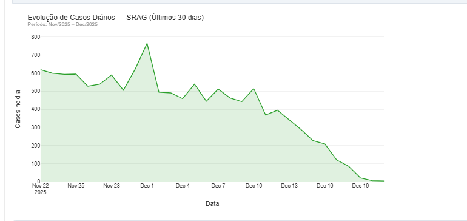
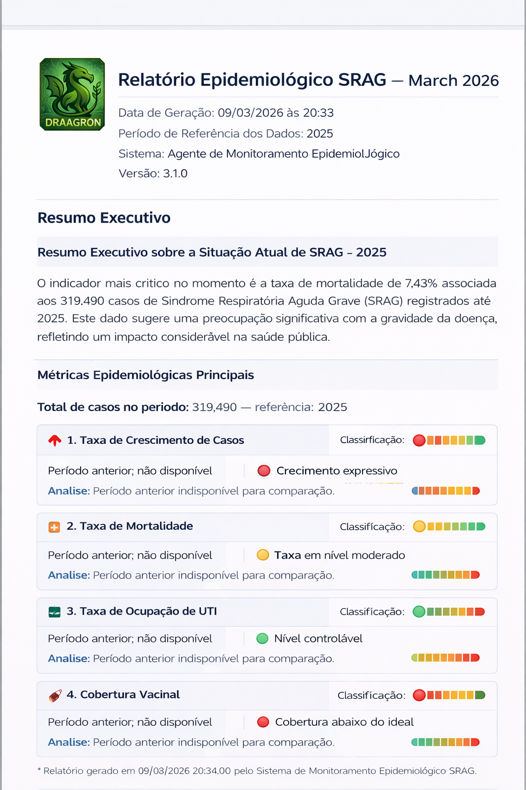
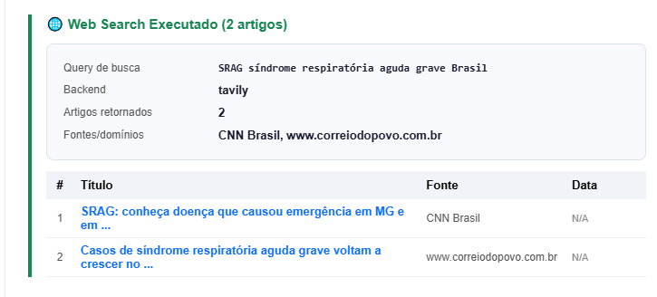

# <!-- HEADER -->
<p align="center">
  
</p>

<h1 align="center">Agente Epidemiológico SRAG</h1>
<h3 align="center">Certificação Artificial Intelligence Engineer · Indicium</h3>

<br>

[](https://databricks.com)
[](https://langchain-ai.github.io/langgraph/)
[](https://langchain.com)
[](https://openai.com)
[](https://delta.io)
[](https://opendatasus.saude.gov.br)

<br>

**Autor:** Nicolas de Siqueira França
📧 [nicolas.draagron@gmail.com](mailto:nicolas.draagron@gmail.com)

---

## Sumário

| # | Seção |
|---|-------|
| 1 | [Sobre o Projeto](#1-sobre-o-projeto) |
| 2 | [Arquitetura da Solução](#2-arquitetura-da-solução) |
| 3 | [Estrutura do Repositório](#3-estrutura-do-repositório) |
| 4 | [Pré-requisitos](#4-pré-requisitos) — tipo de cluster, secrets CLI, alternativa Databricks LLM |
| 5 | [Como Executar](#5-como-executar) |
| 6 | [Resultados Obtidos](#6-resultados-obtidos) |
| 7 | [Análise Epidemiológica Detalhada](#7-análise-epidemiológica-detalhada) |
| 8 | [Notas de Interpretação dos Dados](#8-notas-de-interpretação-dos-dados) |
| 9 | [Documentação Detalhada](#9-documentação-detalhada) |

---

## 1. Sobre o Projeto

### Contexto

A **Indicium HealthCare Inc.** precisava de uma solução baseada em dados para fornecer, em tempo real, métricas sobre a severidade e o avanço de surtos de doenças a profissionais de saúde.

Este projeto é a **Prova de Conceito (PoC)** desenvolvida sobre dados reais de internações por **Síndrome Respiratória Aguda Grave (SRAG)** do Open DATASUS (versão 26/06/2025), cobrindo o período de 2023 a 2025.

### Dois componentes, um sistema integrado

A solução é dividida em duas camadas com ciclos de vida independentes:

**Pipeline de Dados (Engenharia de Dados)**
Transforma 3 CSVs brutos (~823 MB · 870.914 linhas) em 5 tabelas Gold analíticas e 2 tabelas RAG (7 no total), passando por camadas Bronze, Quality, EDA e Silver. Os dados produzidos são a única fonte de verdade consumida pelo agente.

**Agente Orquestrador (Inteligência Artificial)**
LangGraph StateGraph que classifica a intenção da pergunta e coordena as ferramentas corretas — SQL, RAG, geração de gráficos e busca de notícias — para gerar respostas epidemiológicas fundamentadas em dados.

### O que esta solução entrega

| Entrega | Descrição | Status |
|---|---|---|
| **4 métricas obrigatórias** | Taxa de crescimento, mortalidade, UTI e vacinação — calculadas via SQL nas tabelas Gold | ✅ Implementado |
| **2 gráficos obrigatórios** | Casos diários (últimos 30 dias) e casos mensais (últimos 12 meses) — Plotly HTML + PNG | ✅ Implementado |
| **Relatório epidemiológico automatizado** | Documento Markdown + JSON com métricas, gráficos e narrativa analítica gerada por LLM | ✅ Implementado |
| **Notícias em tempo real** | Artigos recentes sobre SRAG via Tavily API, integrados ao relatório | ✅ Implementado |
| **Análise contextual com RAG** | 347 documentos Gold indexados por Databricks Vector Search (BGE-Large 1024d), usados para fundamentar respostas conceituais | ✅ Implementado |

### Métricas Obtidas em Execução Real

| Métrica | 2025 | 2024 | 2023 |
|---|---|---|---|
| **Total de casos** | 319.490 | 266.203 | 277.399 |
| **Taxa de crescimento** | −0,68% | −4,04% | — |
| **Taxa de mortalidade** | 7,43% | 8,53% | 9,83% |
| **Taxa de ocupação UTI** | 26,76% | 28,71% | 27,65% |
| **Taxa de vacinação** | 28,77% | 22,96% | 23,54% |
| **Idade mediana (anos)** | 38,2 | 39,9 | 41,1 |
| **Tempo médio notificação (dias)** | 6,2 | 7,5 | 7,2 |

> **Tendência de mortalidade:** ▼ 1,30 pp (2023→2024) · ▼ 1,10 pp (2024→2025) — queda consistente nos três anos, possivelmente associada ao aumento de cobertura vacinal (+5,23 pp no mesmo período) e à mudança no perfil etiológico dominante (de COVID para Influenza e outros vírus respiratórios).

---

## 2. Arquitetura da Solução

### Separação entre camadas

A solução foi projetada com **duas camadas independentes**: o pipeline de dados e o agente. Essa separação garante que o pipeline possa ser atualizado (quando novos dados SIVEP-Gripe forem publicados) sem nenhuma alteração no agente, e que o agente possa evoluir (novos prompts, novas ferramentas, novo LLM) sem re-executar o pipeline.

O **LangGraph StateGraph** é o núcleo do agente: cada estratégia de execução (`SQL_ONLY`, `RAG_ONLY`, `HYBRID`, `CHART`, `REPORT`) é um nó isolado no grafo, com estado tipado e auditável.

```
┌──────────────────────────────────────────────────────────────────────────┐
│  CAMADA 1 — PIPELINE DE DADOS  (Engenharia de Dados)                      │
│                                                                            │
│  SIVEP-Gripe 2023 / 2024 / 2025  (~823 MB · 870.914 linhas)               │
│        │                                                                   │
│        ▼                                                                   │
│  Bronze (ingestão bruta + metadados técnicos)                              │
│        │                                                                   │
│        ▼                                                                   │
│  Quality (validações formais · score de qualidade · histórico)             │
│        │                                                                   │
│        ▼                                                                   │
│  EDA (séries temporais · mortalidade · UTI · vacinação · correlações)      │
│        │                                                                   │
│        ▼                                                                   │
│  Silver (silver_srag_clean · 863.092 registros · flags epidemiológicas)    │
│        │                                                                   │
│        ▼                                                                   │
│  Gold (7 tabelas analíticas) ─────────────→  RAG (347 docs indexados)     │
│                                                                            │
│  Catálogo: dbx_srag_lab  ·  Schemas: data_original · silver · gold        │
└──────────────────────────────────────┬───────────────────────────────────┘
                                       │ consome
┌──────────────────────────────────────▼───────────────────────────────────┐
│  CAMADA 2 — AGENTE  (Inteligência Artificial)                              │
│                                                                            │
│  Pergunta → Intent Router → LangGraph StateGraph                           │
│                               ├── SQL_ONLY  → tabelas Gold                 │
│                               ├── RAG_ONLY  → Vector Search Index          │
│                               ├── HYBRID    → SQL + RAG                    │
│                               ├── CHART     → Plotly HTML + PNG            │
│                               └── REPORT    → SQL + RAG + Chart + Notícias │
│                                                                            │
│  Controles: SQLGuardrails · AuditLogger · Hierarquia de Exceções           │
└───────────────────────────────────────────────────────────────────────────┘
```

> 📄 **Diagrama conceitual completo:** [`../diagrama_arquitetura.pdf`](../diagrama_arquitetura.pdf)

---

## 3. Estrutura do Repositório

```
📦 ai-srag-indicium/
│
├── 📄 README.md                              ← Este arquivo — visão geral do projeto
│
├── 📁 ../
│   ├── 📄 README_pipeline_dados.md           ← Documentação do Pipeline Medallion Bronze→Gold+RAG
│   ├── 📄 README_agente.md                   ← Documentação do Agente: LangGraph, RAG, Tools, Guardrails
│   ├── 📄 diagrama_arquitetura.pdf           ← Diagrama conceitual (entrega obrigatória da certificação)
│   └── 📁 images/                            ← Imagens e evidências visuais do projeto
│
├── 📁 notebooks/
│   │
│   │  ── Pipeline de Dados ──────────────────────────────────────────────
│   ├── 📄 01_Bronze_Ingestion_SRAG.py
│   ├── 📄 02_Data_Quality_Validation.py
│   ├── 📄 03_eda_srag_exploratory_analysis.py
│   ├── 📄 01_Silver_SRAG.py
│   ├── 📄 00_pipeline_gold.py                ← Orquestrador Gold
│   ├── 📄 01_gold_setup.py
│   ├── 📄 02_gold_metricas_temporais.py
│   ├── 📄 03_gold_metricas_geograficas.py
│   ├── 📄 04_gold_metricas_demograficas.py
│   ├── 📄 05_gold_base_conhecimento_rag.py
│   │
│   │  ── Agente ──────────────────────────────────────────────────────────
│   └── 📄 agent_system.ipynb                 ← Ponto de entrada do Agente
│
└── 📁 src/
    ├── 📁 agent/   (intent_router.py · orchestrator.py)
    ├── 📁 rag/      (document_loader.py · rag_chain.py · vector_store.py)
    ├── 📁 tools/    (sql_tool.py · chart_tool.py · report_generator.py · web_search_tool.py)
    └── 📁 utils/    (audit.py · exceptions.py · guardrails.py)
```

---

## 4. Pré-requisitos

### 4.1 Tipo de Cluster — Ponto Crítico

> ⚠️ **Este é o requisito mais importante para o funcionamento pleno do agente.**

O cluster Databricks **deve ser do tipo híbrido (ex.: Azure Databricks)** — não utilize clusters totalmente gerenciados pela Databricks (Serverless gerenciado). Clusters gerenciados bloqueiam conexões de saída para APIs externas, o que faz o agente cair em modo de fallback para ambas as integrações principais:

| Integração | Cluster gerenciado (Serverless) | Cluster híbrido (Azure) |
|---|---|---|
| OpenAI (GPT-4o-mini) | ❌ Bloqueado → fallback para Llama | ✅ Funcional |
| Tavily API (Web Search) | ❌ Bloqueado → sem notícias | ✅ Funcional |
| Databricks Vector Search | ✅ Funcional | ✅ Funcional |
| Tabelas Gold / Delta | ✅ Funcional | ✅ Funcional |

O agente foi desenvolvido e certificado em **Azure Databricks com cluster híbrido**. Com qualquer outro tipo de cluster que restrinja egress de rede, as ferramentas de busca web e o LLM primário não estarão disponíveis — o agente continuará operando, mas com capacidades reduzidas.

---

### 4.2 Infraestrutura

| Recurso | Especificação |
|---|---|
| Plataforma | Azure Databricks — cluster híbrido (não Serverless gerenciado) |
| Unity Catalog | `dbx_srag_lab` com schemas `data_original`, `silver`, `gold`, `audit` |
| Volume | `dbx_srag_lab.default.srag_outputs` |
| Databricks Vector Search | Endpoint `srag_vector_endpoint` ativo |

---

### 4.3 Configuração de Secrets via CLI

O agente lê todas as credenciais do **Databricks Secret Store** — nenhuma chave é exposta em código ou variável de ambiente. Para configurar, execute os comandos abaixo via **Databricks CLI** (uma única vez):

**Passo 1 — Criar o scope `ai-engineer`:**

```bash
databricks secrets create-scope --scope ai-engineer
```

**Passo 2 — Adicionar as chaves de API:**

```bash
# Chave da OpenAI (LLM primário — GPT-4o-mini)
databricks secrets put --scope ai-engineer --key openai-api-key

# Chave da Tavily (Web Search — notícias em tempo real)
databricks secrets put --scope ai-engineer --key tavily-api-key
```

> Após executar `put`, o CLI abrirá um editor para você colar o valor da chave com segurança. O valor nunca fica visível em logs ou histórico de terminal.

**Verificação:**

```bash
# Lista as chaves cadastradas no scope (mostra apenas os nomes, nunca os valores)
databricks secrets list --scope ai-engineer
```

Saída esperada:

```
Key name         Last updated
---------------  -------------------------
openai-api-key   2026-XX-XX XX:XX:XX UTC
tavily-api-key   2026-XX-XX XX:XX:XX UTC
```

Como as credenciais são lidas no notebook:

```python
OPENAI_API_KEY = dbutils.secrets.get(scope="ai-engineer", key="openai-api-key")
TAVILY_API_KEY = dbutils.secrets.get(scope="ai-engineer", key="tavily-api-key")
```

---

### 4.4 Alternativa sem OpenAI — Modelo Nativo Databricks

Caso não queira utilizar a OpenAI (sem custo de token adicional), o agente suporta troca para o modelo nativo do Databricks Foundation Models. Basta alterar uma linha na célula de configuração do notebook:

```python
# Configuração padrão — OpenAI (LLM primário, requer openai-api-key no scope)
LLM_PROVIDER = "openai"

# Alternativa — modelo nativo Databricks (sem custo de token adicional)
LLM_PROVIDER = "databricks"
```

Quando `LLM_PROVIDER = "databricks"`, o agente utiliza automaticamente:

```
databricks-meta-llama-3-3-70b-instruct
```

> **Quando usar cada opção:** o GPT-4o-mini (`openai`) produz narrativas mais fluidas e sínteses mais precisas em português. O Llama 70B (`databricks`) é uma alternativa robusta sem custo adicional — recomendado quando o cluster não tem acesso à API da OpenAI ou para reduzir dependências externas.

---

## 5. Como Executar

### Etapa 1 — Pipeline de Dados

Execute uma única vez, ou sempre que novos dados SIVEP-Gripe forem disponibilizados.

```
1. 01_Bronze_Ingestion_SRAG
2. 02_Data_Quality_Validation
3. 03_eda_srag_exploratory_analysis
4. 01_Silver_SRAG
5. 00_pipeline_gold  →  executa internamente (em paralelo onde possível):
   ├── 01_gold_setup                  (obrigatório primeiro)
   ├── 02_gold_metricas_temporais  ─┐
   ├── 03_gold_metricas_geograficas ├─ paralelo
   ├── 04_gold_metricas_demograficas┘
   └── 05_gold_base_conhecimento_rag  (último — cria índice vetorial)
```

### Etapa 2 — Agente

```
agent_system.ipynb
```

Flags de execução disponíveis:

```python
RUN_SETUP         = True   # Cria diretórios no Volume (primeira vez)
RUN_RAG_INDEX     = True   # Cria/atualiza índice vetorial
RUN_AGENT         = True   # Executa a consulta principal
RUN_VALIDATION    = True   # Verificações operacionais pós-execução
RUN_CERTIFICATION = True   # Suite completa: SQL · RAG · CHART · HYBRID · REPORT
```

**Exemplo de consulta:**

```python
USER_QUERY = """
Gere um relatório epidemiológico completo de SRAG no Brasil incluindo:
1. Taxa de crescimento de casos, mortalidade, UTI e vacinação
2. Gráfico de casos diários (últimos 30 dias)
3. Gráfico de casos mensais (últimos 12 meses)
4. Notícias recentes e análise do cenário atual
"""
result = orchestrator.run(user_query=USER_QUERY)
# status: OK | tempo: ~77s | estratégia: REPORT | erros: 0
```

---

## 6. Resultados Obtidos

### 6.1 Pipeline de Dados

| Etapa | Registros | Detalhe |
|---|---|---|
| Bronze (entrada) | 870.914 | 3 CSVs · anos 2023, 2024, 2025 · ~823 MB |
| Silver (saída) | **863.092** | após filtros epidemiológicos F1–F4 + deduplicação |
| Tabelas Gold produzidas | **7** | temporal, geográfica, demográfica, histórica, diária, RAG (×2) |
| Documentos RAG indexados | **347** | 339 fatos KPI + 8 regras metodológicas |
| Período coberto | 2023-01-01 a 2025-12-21 | baseado em `dt_sin_pri` |

### 6.2 Agente — Certificação de Qualidade (09/03/2026)

```
  OK  Pipeline sem erros críticos
  OK  Success rate >= 80%                    → 100.0%
  OK  taxa_mortalidade calculada             → 7.43%
  OK  taxa_uti calculada                     → 26.76%
  OK  taxa_vacinacao calculada               → 28.77%
  OK  taxa_crescimento calculada             → -0.68%
  OK  Gráficos gerados (>= 2)               → 5 gráficos
  OK  RAG disponível e retrieval OK          → 5/5 testes
  OK  Todas as 5 estratégias cobertas       → SQL · RAG · HYBRID · CHART · REPORT
  OK  4 testes de conversa aprovados        → T1_SQL · T2_RAG · T3_CHART · T4_HYBRID
  OK  Dados Gold atuais                     → max_mes = 2025-12
────────────────────────────────────────────────
  pontos: 31/31  |  score: 100.0%
```

**Consistência agente vs. SQL direto (ground truth):**

| Métrica | Agente | Ground Truth | Delta |
|---|---|---|---|
| Taxa de mortalidade | 7,43% | 7,43% | **0,00 pp** |
| Taxa UTI | 26,76% | 26,76% | **0,00 pp** |
| Taxa de vacinação | 28,77% | 28,77% | **0,00 pp** |

> As métricas calculadas pelo agente via LLM+SQL são idênticas ao resultado de queries SQL diretas sobre as tabelas Gold — confirmando a integridade do pipeline.

### 6.3 Artefatos Gerados por Execução (estratégia REPORT)

| Artefato | Localização no Volume |
|---|---|
| Relatório Markdown | `/reports/markdown/relatorio_srag_*.md` (~7,7 KB) |
| Relatório JSON | `/reports/json/relatorio_srag_*.json` (~10,2 KB) |
| Gráfico área (tendência diária) | `/charts/custom/srag_area_*.html` |
| Gráfico mensal (12 meses) | `/charts/monthly/srag_mensal_*.html` |
| Gráfico geográfico (×2) | `/charts/custom/srag_bar_*.html` |
| Gráfico viral (distribuição etiológica) | `/charts/custom/srag_multi_line_*.html` |
| Log de auditoria JSON | `/logs/audit/audit_{session_id}.json` (~26 KB) |
| Log de auditoria Delta | `dbx_srag_lab.audit.agent_audit_logs` — 77+ eventos |

### 6.4 Cobertura de Roteamento — Execução Real

| Tipo de query | Estratégia | Intent | Confiança |
|---|---|---|---|
| Total de casos por ano | SQL_ONLY | factual | 90% |
| Top estados em 2024 | SQL_ONLY | factual | 70% |
| Distribuição por faixa etária | SQL_ONLY | factual | 90% |
| O que é SRAG / cálculo de mortalidade | RAG_ONLY | explanatory | 70% |
| Metodologia taxa de UTI | RAG_ONLY | analytical | 70% |
| Comparativo mortalidade 2023 vs 2025 | HYBRID | mixed | 55% |
| Evolução últimos 6 meses + causas | HYBRID | mixed | 90% |
| Gráfico de barras por estado | CHART | chart_request | 85% |
| Relatório epidemiológico completo | REPORT | report_request | 85% |

### 6.5 Evidências Visuais

#### Gráfico de Casos Diários — últimos 30 dias

<p align="center">
  
</p>

#### Gráfico de Casos Mensais — últimos 12 meses

<p align="center">
  
</p>

#### Exemplo de Relatório Epidemiológico Gerado

<p align="center">
  
</p>

#### Exemplo de Notícias Recuperadas em Tempo Real

<p align="center">
  
</p>

---

## 7. Análise Epidemiológica Detalhada

Esta seção consolida as análises produzidas pelo pipeline e pelo agente em execução real. Todos os números foram gerados a partir das tabelas Gold e validados por SQL direto.

### 7.1 Breakdown Etiológico por Ano

Uma das tendências mais relevantes do período é a **mudança no perfil etiológico dominante**: a participação de COVID caiu de 17,8% para 5,0% dos casos, enquanto Influenza triplicou sua presença e os demais vírus respiratórios (VSR, rinovírus, adenovírus etc.) se tornaram a etiologia mais frequente em 2025.

| Ano | COVID | Influenza | Outros vírus | Sem classificação |
|---|---|---|---|---|
| 2023 | 49.386 (17,8%) | 13.344 (4,8%) | 48.867 (17,6%) | 8.360 |
| 2024 | 30.622 (11,5%) | 25.534 (9,6%) | 64.729 (24,3%) | 9.068 |
| 2025 | 15.989 (5,0%) | 43.834 (13,7%) | 98.151 (30,7%) | 16.960 |

> A ascensão da Influenza e de outros vírus respiratórios como causas dominantes de SRAG em 2025 é o principal fator etiológico a considerar na interpretação da queda de mortalidade — populações imunizadas contra Influenza tendem a ter desfechos menos graves que pacientes COVID não vacinados.

### 7.2 Análise Trimestral (2023–2025)

A análise trimestral revela que o segundo trimestre (abril–junho) concentra consistentemente o maior volume de casos, com o pico histórico registrado em Q2/2025.

| Trimestre | Casos 2023 | Casos 2024 | Casos 2025 | Mort. 2023 | Mort. 2024 | Mort. 2025 |
|---|---|---|---|---|---|---|
| Q1 (Jan–Mar) | 72.468 | 56.025 | 51.484 | 11,0% | 11,7% | 9,4% |
| Q2 (Abr–Jun) | 92.592 | 89.410 | **135.853** | 8,7% | 6,9% | 7,4% |
| Q3 (Jul–Set) | 59.414 | 67.554 | 81.964 | 8,9% | 8,4% | 7,0% |
| Q4 (Out–Dez) | 52.925 | 53.214 | 50.189 | 12,0% | 8,8% | **5,7%** |

> Q2/2025 registrou 135.853 casos — 52% acima do Q2/2024 — puxado pelo pico de maio/2025 (56.033 casos). O Q4 apresenta consistentemente a mortalidade mais elevada nos três anos analisados, exceto em 2025 onde a queda foi mais expressiva (5,7%).

### 7.3 Padrão Sazonal — Média Mensal (2023–2025)

| Mês | Média de casos | Máximo | Mínimo | Mortalidade média |
|---|---|---|---|---|
| Janeiro | 15.435 | 19.475 | 12.758 | 13,65% |
| Fevereiro | 18.556 | 21.878 | 15.704 | 10,24% |
| Março | 26.001 | 31.115 | 21.707 | 8,25% |
| Abril | 31.537 | 32.011 | 30.970 | 7,40% |
| **Maio** | **40.290** | **56.033** | **30.373** | **7,87%** |
| Junho | 34.125 | 47.809 | 27.159 | 7,75% |
| Julho | 25.128 | 32.015 | 21.438 | 8,29% |
| Agosto | 23.024 | 25.965 | 19.472 | 7,80% |
| Setembro | 21.492 | 23.984 | 18.504 | 8,15% |
| Outubro | 21.131 | 23.380 | 19.132 | 8,36% |
| Novembro | 18.210 | 19.616 | 17.466 | 8,60% |
| Dezembro | 12.769 | 16.616 | 7.193 | 9,51% |

> O padrão sazonal mostra dois momentos de pressão: elevação progressiva de março a maio (pico de inverno precoce, influenciado por Influenza) e mortalidade mais alta em janeiro e dezembro — período em que casos graves tendem a ser de pacientes com comorbidades mais severas e menor cobertura vacinal recente.

### 7.4 Picos e Vales Anuais

| Ano | Mês pico (casos) | N.º casos | Mês vale | N.º casos | Mês pico (mortalidade) |
|---|---|---|---|---|---|
| 2023 | Maio/2023 | 34.463 | Dezembro/2023 | 14.497 | Janeiro/2023 (14,8%) |
| 2024 | Abril/2024 | 31.631 | Janeiro/2024 | 12.758 | Janeiro/2024 (13,8%) |
| 2025 | **Maio/2025** | **56.033** | Dezembro/2025 | 7.193 | Janeiro/2025 (12,3%) |

### 7.5 Mortalidade × Vacinação — Mês a Mês em 2025

A série mensal de 2025 permite observar diretamente a relação inversa entre cobertura vacinal e mortalidade ao longo do ano:

| Mês | Casos | Mortalidade | Vacinação | Taxa UTI | Observação |
|---|---|---|---|---|---|
| Jan/2025 | 14.073 | 12,28% | 46,97% | 32,02% | ⚠️ mortalidade alta — início do ano |
| Fev/2025 | 15.704 | 9,31% | 36,01% | 30,21% | |
| Mar/2025 | 21.707 | 6,72% | 26,09% | 28,74% | |
| Abr/2025 | 32.011 | 6,28% | 8,50% | 27,70% | ⚠️ provável subregistro vacinal |
| Mai/2025 | 56.033 | 7,94% | 16,77% | 25,25% | pico de casos |
| Jun/2025 | 47.809 | 8,01% | 28,32% | 24,68% | |
| Jul/2025 | 32.015 | 7,57% | 32,34% | 26,58% | |
| Ago/2025 | 25.965 | 7,03% | 35,25% | 26,99% | |
| Set/2025 | 23.984 | 6,36% | 37,04% | 26,75% | |
| Out/2025 | 23.380 | 5,76% | 38,70% | 26,41% | |
| Nov/2025 | 19.616 | 5,47% | 39,61% | 26,57% | |
| Dez/2025 | 7.193 | 5,86% | 40,18% | 25,41% | dados preliminares (cutoff SIVEP) |

> A partir de julho/2025, com vacinação acima de 32% e cobertura crescente, a mortalidade manteve trajetória descendente consistente até atingir 5,47% em novembro — o menor valor registrado na série histórica de 3 anos.

---

## 8. Notas de Interpretação dos Dados

As seções abaixo são fundamentais para interpretar corretamente os números produzidos pelo pipeline e pelo agente.

### 8.1 Cutoff e Atraso do SIVEP-Gripe

O SIVEP-Gripe fecha os dados anuais com atraso de **6 a 8 semanas**. Os dados de dezembro/2025 são **preliminares** e subestimam o volume real — a queda de −63,3% registrada em dezembro é em grande parte artefato de subnotificação, não tendência epidemiológica real.

A taxa de crescimento calculada pelo agente (**−0,68%**) exclui propositalmente os últimos 14 dias da série diária por este motivo.

```
Série diária disponível : 2025-11-22 → 2025-12-21
Último dia com dado estável : 2025-12-15 (227 casos)
Últimos dias com subnotificação confirmada:
  2025-12-21 : 4 casos   ← subnotificação severa
  2025-12-20 : 6 casos   ← subnotificação severa
  2025-12-19 : 21 casos
```

### 8.2 Subregistro de Vacinação em Abril–Maio/2025

Os valores de cobertura vacinal em abril (8,5%) e maio (16,8%) de 2025 estão abaixo do padrão histórico e são **provavelmente subregistro de campo**, não queda real de vacinação. A média de junho a dezembro/2025 (~37%) é o valor mais confiável para análise de tendência vacinal no ano.

### 8.3 Mortalidade Alta em Janeiro de Cada Ano

A mortalidade elevada no início do ano (jan/2023: 14,8%, jan/2024: 13,8%, jan/2025: 12,3%) reflete um padrão estrutural do SIVEP: os casos registrados em janeiro tendem a ser os mais graves do período de festas — com maior exposição, menor acesso a UBS e atraso diagnóstico. Não indica deterioração do sistema de saúde.

### 8.4 Sobre o `status=UNKNOWN` no Vector Search Index

O índice vetorial pode reportar `status=UNKNOWN` após execuções onde nenhum dado novo foi gravado (skip-write). Isso é comportamento esperado do Databricks Vector Search e **não indica falha funcional** — o endpoint permanece ONLINE e o retriever retorna documentos normalmente. Valide com uma query de teste ao retriever antes de concluir que o índice está inativo.

---

## 9. Documentação Detalhada

Este README apresenta a visão geral e os principais resultados. A documentação técnica de cada camada está nos documentos abaixo:

| Documento | Conteúdo |
|---|---|
| [`../README_pipeline_dados.md`](../README_pipeline_dados.md) | Pipeline Medallion completo: Bronze, Quality, EDA, Silver, Gold, RAG — tratamento de dados, definição das métricas epidemiológicas, tabelas produzidas e resultados reais de cada etapa |
| [`../README_agente.md`](../README_agente.md) | Arquitetura do agente: LangGraph StateGraph, Intent Router, 5 estratégias de execução, RAG, Tools, SQLGuardrails, AuditLogger, exemplos reais de saída |
| [`../diagrama_arquitetura.pdf`](../diagrama_arquitetura.pdf) | Diagrama conceitual da solução completa: Orquestrador + Tools + LLM + banco de dados + fontes de notícias (entrega obrigatória da certificação) |

---

<p align="center">
  <sub>Certificação Artificial Intelligence Engineer · Indicium · 2026</sub>
</p>
