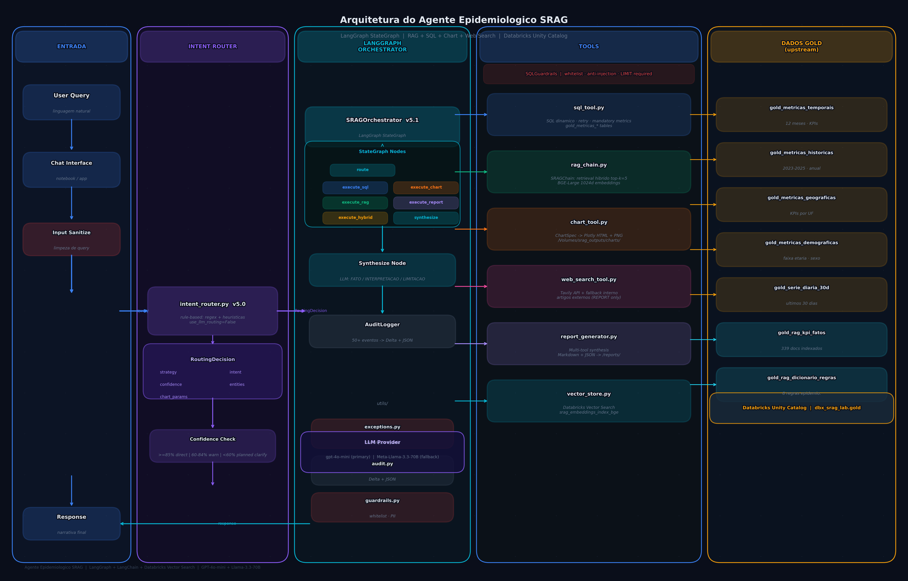
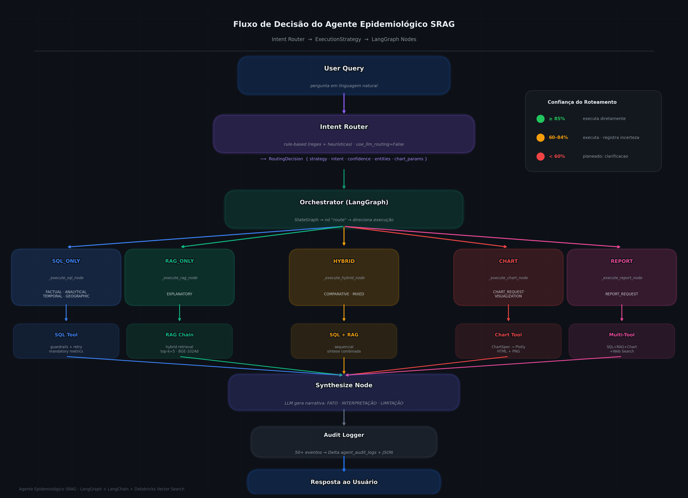
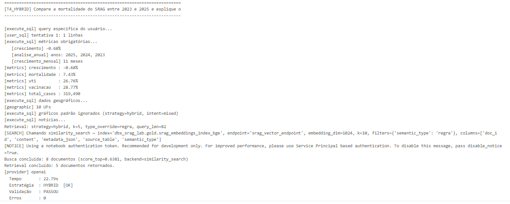
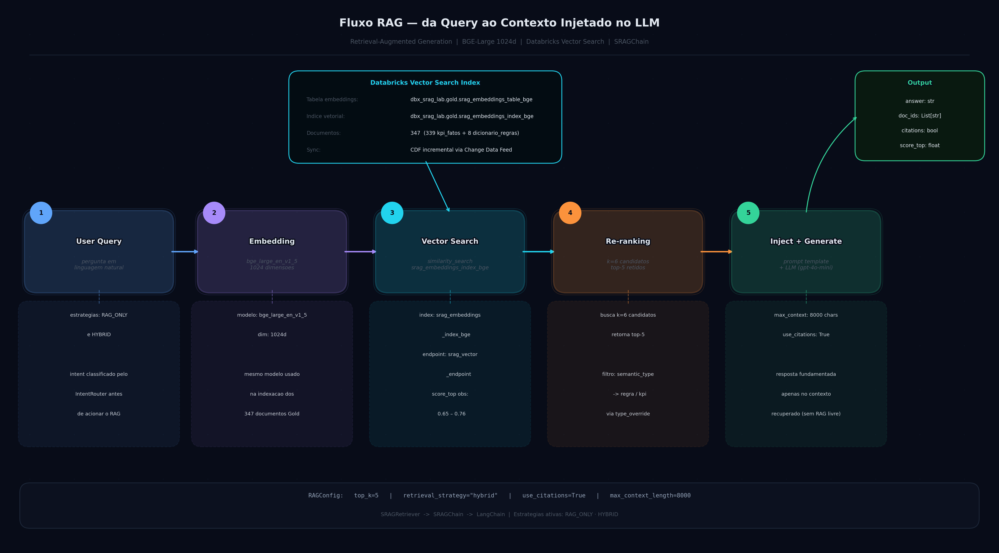
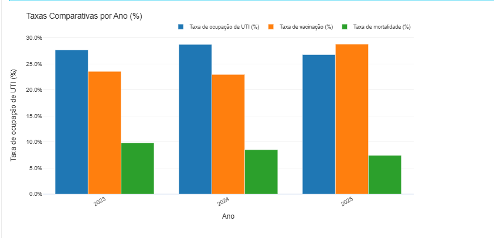
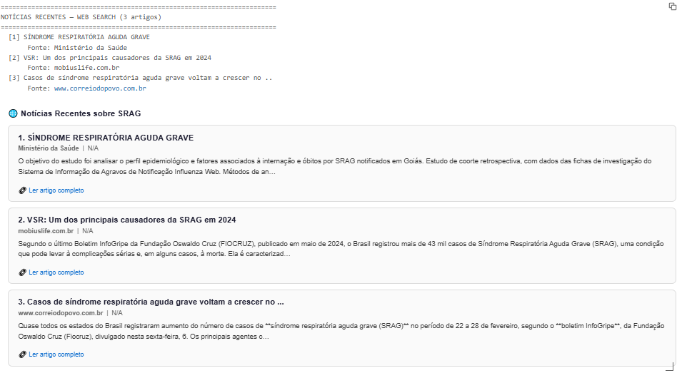
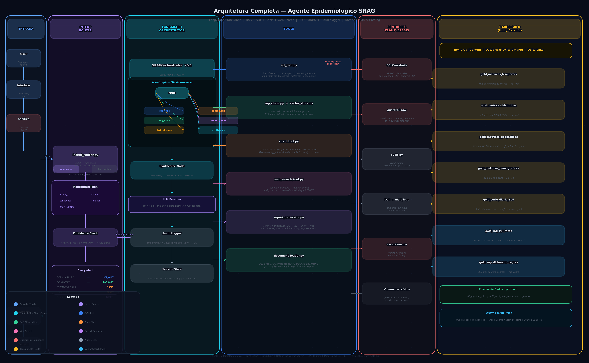
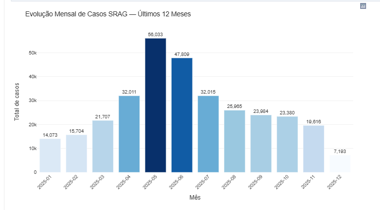
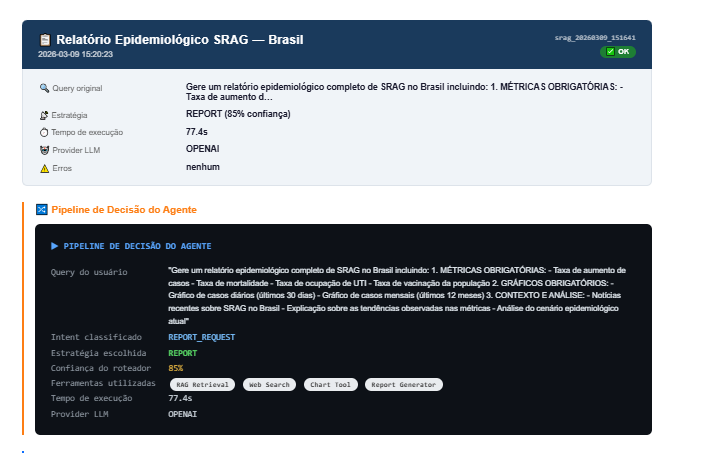

# <!-- HEADER -->
<p align="center">
  
</p>

### Agente RAG · LangGraph · Tools · Guardrails · Databricks

<br>

[](https://databricks.com)
[](https://langchain-ai.github.io/langgraph/)
[](https://langchain.com)
[](https://delta.io)
[](https://docs.databricks.com/data-governance/unity-catalog)
[](https://opendatasus.saude.gov.br)

<br>

**Feito por Nicolas de Siqueira França**
📧 [nicolas.draagron@gmail.com](mailto:nicolas.draagron@gmail.com)

---

> **Escopo deste README:** camada de **Agente** — orquestração via LangGraph, roteamento de intenção, RAG, tools (SQL, Chart, Report, Web Search) e controles (guardrails, auditoria, exceções).
> Os detalhes do pipeline de dados (Bronze → Gold + RAG tables) ficam no README de Engenharia de Dados.

---

## 📋 Sumário

| # | Seção |
|---|-------|
| 1 | [Visão Geral](#1-visão-geral) |
| 2 | [Arquitetura](#2-arquitetura) |
| 3 | [Estrutura do Projeto](#3-estrutura-do-projeto) |
| 4 | [Como Executar](#4-como-executar) |
| 5 | [Fluxo de Decisão do Agente](#5-fluxo-de-decisão-do-agente) |
| 6 | [Agents — Orquestrador e Intent Router](#6-agents--orquestrador-e-intent-router) |
| 7 | [Estratégia de RAG](#7-estratégia-de-rag) |
| 8 | [Tools — Documentação Detalhada](#8-tools--documentação-detalhada) |
| 9 | [Utils — Controles Transversais](#9-utils--controles-transversais) |
| 10 | [Observabilidade e Governança](#10-observabilidade-e-governança) |
| 11 | [Estratégias de Fallback](#11-estratégias-de-fallback) |
| 12 | [Exemplos de Execução](#12-exemplos-de-execução) |
| 13 | [Design Decisions](#13-design-decisions) |
| 14 | [Evidências Visuais](#14-evidências-visuais) |
| 15 | [Limitações e Próximos Passos](#15-limitações-e-próximos-passos) |
| 16 | [Apêndice — Módulos e Responsabilidades](#16-apêndice--módulos-e-responsabilidades) |

---

## 1. Visão Geral

O **Agente Epidemiológico SRAG** é uma camada de inteligência conversacional que consome as tabelas Gold e RAG produzidas pelo pipeline de Engenharia de Dados para responder perguntas sobre vigilância de Síndrome Respiratória Aguda Grave (SRAG) no Brasil.

Diferente de um chatbot genérico, o sistema tem responsabilidades bem definidas:

- **Classifica a intenção** da query antes de qualquer execução
- **Seleciona a estratégia adequada** entre cinco modos de execução
- **Recupera contexto epidemiológico confiável** via RAG e SQL
- **Valida SQL antes de executá-lo** via guardrails
- **Rastreia cada decisão** com auditoria ponta a ponta

| Atributo | Descrição |
|---|---|
| 🧠 Orquestrado | Grafo LangGraph (`StateGraph`) com nós dedicados por estratégia de execução |
| 🔍 RAG-first | Respostas fundamentadas em 347 documentos Gold indexados por `bge_large_en_v1_5` |
| 🛠️ Tool-augmented | SQL dinâmico, geração de gráficos HTML+PNG, relatórios e busca web via Tavily |
| 🛡️ Controlado | `SQLGuardrails` com whitelist de tabelas, detecção de injeção e validação de SELECT |
| 📋 Auditável | 50+ eventos por sessão persistidos em `dbx_srag_lab.audit.agent_audit_logs` |

### 🛠️ Tecnologias

| Tecnologia | Uso |
|---|---|
| **Databricks Serverless** | Ambiente de execução principal |
| **Databricks Vector Search** | Índice semântico `srag_embeddings_index_bge` sobre tabelas RAG Gold |
| **LangGraph** | Grafo de orquestração (`StateGraph`) com nós por estratégia |
| **LangChain** | RAG chain, tool wrappers e integração com LLMs |
| **GPT-4o-mini (OpenAI)** | LLM primário — síntese de respostas e geração de narrativa |
| **Meta-Llama-3.3-70B (Databricks)** | LLM de fallback via Foundation Models (zero custo de token) |
| **Delta Lake / Unity Catalog** | Fonte das tabelas Gold e destino dos logs de auditoria |
| **Plotly** | Geração de visualizações HTML interativas + PNG estático |

---

## 2. Arquitetura

### 2.1 Fluxo Principal

O agente opera em quatro estágios sequenciais:

```
User Query → Intent Router → Orchestrator (LangGraph) → Tools / RAG / SQL / Web → LLM → Response
```

- **Intent Router:** recebe a query bruta e produz um `RoutingDecision` com a estratégia de execução, a intenção classificada e os parâmetros extraídos. Opera em modo rule-based por padrão.
- **Orchestrator (LangGraph):** consome o `RoutingDecision` e direciona a execução para o nó correto do `StateGraph`. Cada estratégia é um nó isolado com estado tipado.
- **Tools / RAG / SQL / Web:** camada de execução. O nó ativo chama as tools necessárias (podendo combinar SQL + RAG + Chart + Web Search).
- **Synthesize node:** após a execução, o LLM gera a narrativa final com base nos resultados coletados no estado do grafo.

<p align="center">
  
</p>

### 2.2 Visão Macro — Agente + Integrações

```
┌─────────────────────────────────────────────────────────────┐
│                    ENTRADA DO USUÁRIO                        │
└──────────────────────────┬──────────────────────────────────┘
                           │
                    ┌──────▼──────────┐
                    │  Intent Router  │  ← classifica intenção (rule-based)
                    └──────┬──────────┘
                           │  RoutingDecision {strategy, intent, confidence, chart_params}
                    ┌──────▼──────────────────────────────────────────┐
                    │            SRAGOrchestrator (LangGraph)          │
                    │  StateGraph: route → execute_* → synthesize      │
                    └──┬──────┬─────────┬──────────┬──────────────────┘
                       │      │         │          │
              ┌────────┘ ┌────┘    ┌────┘    ┌────┘
              ▼          ▼         ▼         ▼
       ┌──────────┐ ┌──────────┐ ┌────────────┐ ┌──────────────┐
       │ RAG Chain│ │ SQL Tool │ │ Chart Tool │ │  Web Search  │
       │(hybrid)  │ │(guardrails│ │ HTML + PNG │ │(Tavily API)  │
       │ top-k=5  │ │ ativos)  │ │            │ │              │
       └────┬─────┘ └────┬─────┘ └─────┬──────┘ └──────┬───────┘
            │             │             │                │
            └─────────────┴─────────────┴────────────────┘
                                    │
                    ┌───────────────▼───────────────┐
                    │        Report Generator        │  ← síntese (estratégia REPORT)
                    └───────────────┬───────────────┘
                                    │
                    ┌───────────────▼───────────────┐
                    │         SQLGuardrails          │  ← validação SQL (input do tool)
                    │  whitelist · injection · limit │
                    └───────────────┬───────────────┘
                                    │
                    ┌───────────────▼───────────────┐
                    │          Audit Logger          │  ← 50+ eventos / sessão
                    │  Delta: agent_audit_logs       │
                    └───────────────┬───────────────┘
                                    │
                    ┌───────────────▼───────────────┐
                    │       RESPOSTA AO USUÁRIO      │
                    └───────────────────────────────┘
```

> 📌 **Nota sobre guardrails:** o `SQLGuardrails` atua na camada de input do `sql_tool` (whitelist + injection + LIMIT). Um guardrail de escopo temático em nível de input/output do agente completo é arquitetura desejada, mas não está implementado no fluxo atual — ver [Seção 15](#15-limitações-e-próximos-passos).

### 2.3 Papel de Cada Componente

| Componente | Responsabilidade | Quando atua | Status |
|---|---|---|---|
| **Intent Router** | Classifica intenção e define `ExecutionStrategy` | Antes de qualquer tool | ✅ Implementado |
| **Orchestrator (LangGraph)** | StateGraph que roteia e executa nós por estratégia | Após classificação | ✅ Implementado |
| **RAG Chain** | Retrieval híbrido + geração com contexto semântico | Estratégias `RAG_ONLY` e `HYBRID` | ✅ Implementado |
| **SQL Tool** | Executa SQL dinâmico com guardrails | Estratégias `SQL_ONLY` e `HYBRID` | ✅ Implementado |
| **Chart Tool** | Gera gráficos Plotly (HTML + PNG) | Estratégias `CHART` e `REPORT` | ✅ Implementado |
| **Report Generator** | Sintetiza multi-tool em relatório Markdown | Estratégia `REPORT` | ✅ Implementado |
| **Web Search Tool** | Busca contexto externo via Tavily | Estratégia `REPORT` e queries de contexto externo | ✅ Implementado |
| **SQLGuardrails** | Whitelist de tabelas, anti-injection, require LIMIT | Input do sql_tool | ✅ Implementado |
| **Audit Logger** | Persiste 50+ eventos por sessão em Delta + JSON | Ao final de cada interação | ✅ Implementado |
| **Guardrail de escopo (input/output)** | Bloquear perguntas fora do domínio SRAG | — | 🚧 Planejado |

### 2.4 Dependência com o Pipeline de Dados

O agente **não gera** os dados — ele os consome. Todas as fontes são exclusivamente tabelas produzidas pelo pipeline de Engenharia de Dados:

| Tabela Gold (upstream) | Uso no agente | Tool consumidora |
|---|---|---|
| `gold_rag_kpi_fatos` | 339 documentos semânticos — base do Vector Search | `rag_chain` |
| `gold_rag_dicionario_regras` | 8 regras epidemiológicas no contexto do prompt | `rag_chain` |
| `gold_metricas_temporais` | KPIs dos últimos 12 meses | `sql_tool` |
| `gold_metricas_historicas` | Histórico anual completo (2023–2025) | `sql_tool` |
| `gold_serie_diaria_30d` | Série diária recente | `sql_tool` + `chart_tool` |
| `gold_metricas_geograficas` | KPIs por UF | `sql_tool` + `chart_tool` |
| `gold_metricas_demograficas` | KPIs por faixa etária e sexo | `sql_tool` + `chart_tool` |

---

## 3. Estrutura do Projeto

```
src/
├── __init__.py
├── agents/
│   ├── __init__.py
│   ├── intent_router.py       ← Classifica intenção → RoutingDecision (v5.0.0)
│   └── orchestrator.py        ← LangGraph StateGraph — coordena tools (v5.1.0)
├── rag/
│   ├── __init__.py
│   ├── document_loader.py     ← Carrega 347 docs Gold como LangChain Documents
│   ├── rag_chain.py           ← SRAGChain: retrieval híbrido + geração
│   └── vector_store.py        ← Databricks Vector Search (BGE-Large 1024d)
├── tools/
│   ├── __init__.py
│   ├── chart_tool.py          ← Gráficos Plotly: HTML interativo + PNG estático
│   ├── report_generator.py    ← Síntese multi-tool em Markdown
│   ├── sql_tool.py            ← SQL dinâmico com SQLGuardrails integrado
│   └── web_search_tool.py     ← Busca externa via Tavily API (+ fallback interno)
└── utils/
    ├── __init__.py
    ├── audit.py               ← AuditLogger: 50+ eventos → Delta + JSON
    ├── exceptions.py          ← Hierarquia de exceções tipadas
    └── guardrails.py          ← SQLGuardrails: whitelist, injection, PII
```

---

## 4. Como Executar

> ⚠️ **Pré-requisito:** o pipeline de Engenharia de Dados (`00_pipeline_gold.py` → `05_gold_base_conhecimento_rag.py`) deve ter sido executado e as tabelas Gold devem estar disponíveis no Unity Catalog `dbx_srag_lab.gold` antes de iniciar o agente.

### 4.1 Variáveis de Ambiente e Secrets

O agente lê credenciais diretamente do **Databricks Secret Store** — sem variáveis de ambiente expostas:

| Secret scope | Chave | Uso |
|---|---|---|
| `ai-engineer` | `openai-api-key` | LLM primário (gpt-4o-mini) |
| `ai-engineer` | `tavily-api-key` | Web Search Tool (Tavily API) |

```python
# Leitura no notebook — padrão adotado
OPENAI_API_KEY = dbutils.secrets.get(scope="ai-engineer", key="openai-api-key")
TAVILY_API_KEY = dbutils.secrets.get(scope="ai-engineer", key="tavily-api-key")
```

### 4.2 Configuração Central do Ambiente

Todas as configurações ficam em uma única célula do notebook:

```python
CATALOG_GOLD  = "dbx_srag_lab"
SCHEMA_GOLD   = "gold"
CATALOG_AUDIT = "dbx_srag_lab"
SCHEMA_AUDIT  = "audit"

VOLUME_BASE = f"/Volumes/{CATALOG_GOLD}/default/srag_outputs"

VS_ENDPOINT_NAME = "srag_vector_endpoint"
VS_INDEX_NAME    = "srag_embeddings_index_bge"
VS_TABLE_NAME    = "srag_embeddings_table_bge"

LLM_PROVIDER         = "openai"            # "databricks" → fallback sem custo
LLM_MODEL_OPENAI     = "gpt-4o-mini"
LLM_MODEL_DATABRICKS = "databricks-meta-llama-3-3-70b-instruct"
LLM_TEMP             = 0.1
LLM_MAX_TOKENS       = 4000
```

### 4.3 Flags de Execução

O notebook principal expõe flags que permitem pular etapas já concluídas:

```python
RUN_SETUP          = True   # Cria diretórios no Volume
RUN_RAG_INDEX      = True   # Cria/atualiza índice vetorial
RUN_AGENT          = True   # Executa o agente (consulta principal)
RUN_VALIDATION     = True   # Verificações operacionais pós-execução
RUN_CERTIFICATION  = True   # Testes de cobertura: SQL, RAG, CHART, HYBRID, REPORT
```

### 4.4 Estrutura de Saídas (Volume)

O notebook cria automaticamente a seguinte estrutura no Unity Catalog Volume:

```
/Volumes/dbx_srag_lab/default/srag_outputs/
├── charts/
│   ├── daily/      ← Gráficos de série diária (.html + .png)
│   ├── monthly/    ← Gráficos mensais (.html + .png)
│   └── custom/     ← Gráficos ad-hoc (area, bar, multi_line)
├── reports/
│   ├── markdown/   ← Relatórios em Markdown
│   └── json/       ← Relatórios estruturados em JSON
└── logs/
    └── audit/      ← Log de sessão em JSON
```

### 4.5 Dependências Principais

| Pacote | Uso |
|---|---|
| `langgraph` | StateGraph do Orchestrator |
| `langchain` / `langchain-openai` | RAG chain, LLM wrappers |
| `databricks-vectorsearch` | Client do Databricks Vector Search |
| `databricks-langchain` | ChatDatabricks (Foundation Models) |
| `pyspark` | Leitura das tabelas Gold via `document_loader` |
| `plotly` | Geração de gráficos HTML interativos e PNG |
| `tavily-python` | Web Search Tool |

---

## 5. Fluxo de Decisão do Agente

### 5.1 Estratégias de Execução

O agente opera com **5 estratégias de execução** (`ExecutionStrategy`), definidas pelo Intent Router e executadas pelo Orchestrator como nós distintos do LangGraph.

A escolha da estratégia determina quais tools serão acionadas e como o resultado será sintetizado:

| Estratégia | Nó LangGraph | Quando é ativada | Exemplo |
|---|---|---|---|
| `SQL_ONLY` | `_execute_sql_node` | Perguntas factuais e analíticas com dados numéricos | *"Qual o total de casos por ano?"* |
| `RAG_ONLY` | `_execute_rag_node` | Perguntas conceituais, metodológicas ou explicativas | *"O que é SRAG e quais agentes etiológicos?"* |
| `HYBRID` | `_execute_hybrid_node` | Perguntas que combinam dados quantitativos e explicação | *"Compare mortalidade 2023 vs 2025 e explique a redução"* |
| `CHART` | `_execute_chart_node` | Requisições explícitas de visualização gráfica | *"Gere um gráfico de barras por estado"* |
| `REPORT` | `_execute_report_node` | Relatórios epidemiológicos completos | *"Gere o relatório epidemiológico completo"* |

<p align="center">
  
</p>

### 5.2 Mapa de Intenções → Estratégias

| Intenção (`QueryIntent`) | Estratégia resultante | Confiança observada |
|---|---|---|
| `FACTUAL` | `SQL_ONLY` | 70–90% |
| `ANALYTICAL` | `SQL_ONLY` ou `HYBRID` | 70–90% |
| `COMPARATIVE` | `HYBRID` | 55–70% |
| `TEMPORAL` | `SQL_ONLY` | 90% |
| `GEOGRAPHIC` | `SQL_ONLY` | 70–90% |
| `DEMOGRAPHIC` | `SQL_ONLY` | 70–90% |
| `EXPLANATORY` | `RAG_ONLY` | 70% |
| `CHART_REQUEST` / `VISUALIZATION` | `CHART` | 85–95% |
| `REPORT_REQUEST` | `REPORT` | 85% |
| `MIXED` | `HYBRID` | 55% |

### 5.3 Lógica de Decisão Passo a Passo

```
[1] INTENT ROUTER  (rule-based por padrão; use_llm_routing=False)
    └── Analisa a query → retorna RoutingDecision:
        {strategy, intent, confidence, entities, chart_params}

[2] ORCHESTRATOR — nó "route"
    └── Lê strategy do RoutingDecision → direciona para o nó correto

[3] NÓ DE EXECUÇÃO (um dos cinco abaixo)
    │
    ├── SQL_ONLY
    │       └── _try_user_specific_query() → retry com SQL simplificado se window function falhar
    │           └── _execute_mandatory_metrics() → taxa_crescimento, mortalidade, uti, vacinacao
    │               └── _execute_geographic_data() → top 10 UFs
    │
    ├── RAG_ONLY
    │       └── SRAGRetriever.retrieve(strategy="hybrid", k=5)
    │           └── SRAGChain.run() → resposta com citações de doc_ids
    │
    ├── HYBRID
    │       └── SQL_ONLY + RAG_ONLY em sequência → síntese combinada
    │
    ├── CHART
    │       └── ChartSpec → _resolve_chart_spec() → _dispatch_chart_spec() → ChartTool
    │           └── Exporta HTML + PNG para /Volumes
    │
    └── REPORT
            └── _execute_sql() + web_search + RAG + chart_tool
                └── Delega ao ReportGenerator (se injetado no construtor)

[4] SYNTHESIZE NODE
    └── _synthesize_node(): gera narrativa final via LLM
        └── Seções: FATO / INTERPRETAÇÃO / LIMITAÇÃO (sem viés hardcoded)

[5] AUDIT LOGGER
    └── Persiste 50+ eventos → Delta + JSON → entrega resposta ao usuário
```

<p align="center">
  
</p>

### 5.4 Roteamento por Confiança — Comportamento Real

O campo `confidence` é registrado no log de auditoria. O roteamento **não é bloqueado por baixa confiança** na implementação atual — a estratégia é executada mesmo com `confidence=55%`.

| Faixa de confiança | Comportamento atual | Comportamento planejado |
|---|---|---|
| `≥ 0.85` | Executa diretamente | Executa diretamente |
| `0.60 – 0.84` | Executa — registra incerteza no log | Executa — registra incerteza |
| `< 0.60` | Executa com `confidence` baixo no log | 🚧 Solicitar clarificação ao usuário |

---

## 6. Agents — Orquestrador e Intent Router

### 6.1 `intent_router.py` (v5.0.0)

**Responsabilidade:** classificar a intenção da query e produzir um `RoutingDecision` que determina qual nó do StateGraph será executado.

O router opera em dois modos:

- **Rule-based** (`use_llm_routing=False`, padrão): usa padrões de regex e heurísticas semânticas. Menor latência e sem custo de token.
- **LLM routing** (`use_llm_routing=True`): implementado, mas desabilitado por padrão. Recomendado para queries ambíguas.

**Estrutura de saída (`RoutingDecision`):**

```python
@dataclass
class RoutingDecision:
    strategy   : ExecutionStrategy  # SQL_ONLY | RAG_ONLY | HYBRID | CHART | REPORT
    intent     : QueryIntent        # FACTUAL | ANALYTICAL | EXPLANATORY | ...
    confidence : float              # 0.55 a 0.95 observados em execução
    entities   : Dict[str, Any]     # {uf, ano, indicador, periodo, ...}
    chart_params: Optional[ChartParams]  # apenas quando strategy=CHART
```

**`ChartParams` — estrutura enriquecida (v5.0.0):**

```python
@dataclass
class ChartParams:
    chart_purpose : str          # trend | ranking | distribution | comparison
    y_cols        : List[str]    # ["total_casos", "taxa_mortalidade"]
    series_col    : Optional[str]
    year_col      : Optional[str]
    top_n         : int          # 10 por padrão
    value_format  : str          # absolute | percentage
```

**Cobertura real de roteamento:**

```
  Tipo               | Estratégia   | Intent                 |  Conf | Query (resumida)
─────────────────────────────────────────────────────────────────────────────────────────
  sql_factual        | SQL_ONLY     | factual                |   90% | Quantos casos em 2025?
  sql_geo            | SQL_ONLY     | factual                |   70% | Top 5 estados 2024?
  sql_demo           | SQL_ONLY     | factual                |   90% | Distribuição por faixa etária?
  rag_analitico      | RAG_ONLY     | explanatory            |   70% | O que é SRAG e como é calculada a mortalidade?
  rag_explicativo    | RAG_ONLY     | analytical             |   70% | Metodologia da taxa de UTI
  hibrido_comp       | HYBRID       | mixed                  |   55% | Compare mortalidade 2023 vs 2025
  hibrido_temp       | SQL_ONLY     | factual                |   90% | Evolução últimos 6 meses
  chart_adhoc        | CHART        | visualization          |   85% | Gráfico de barras por estado
  relatorio_full     | REPORT       | report_request         |   85% | Relatório completo com métricas
─────────────────────────────────────────────────────────────────────────────────────────
  Estratégias cobertas: SQL_ONLY · RAG_ONLY · HYBRID · CHART · REPORT  ✅
```

> **Nota:** queries temporais diretas ("como evoluíram nos últimos 6 meses?") são roteadas para `SQL_ONLY/factual` com confiança 90% — o router interpreta isso como busca de dados, não análise conceitual.

### 6.2 `orchestrator.py` — SRAGOrchestrator (v5.1.0)

**Responsabilidade:** implementar o grafo de execução que transforma um `RoutingDecision` em resposta epidemiológica estruturada.

O Orchestrator é um **LangGraph `StateGraph`** — não um loop simples. Cada estratégia corresponde a um nó isolado com estado tipado (`AgentState`):

```python
graph = StateGraph(AgentState)
graph.add_node("route",           self._route_node)
graph.add_node("execute_sql",     self._execute_sql_node)
graph.add_node("execute_rag",     self._execute_rag_node)
graph.add_node("execute_hybrid",  self._execute_hybrid_node)
graph.add_node("execute_chart",   self._execute_chart_node)
graph.add_node("execute_report",  self._execute_report_node)
graph.add_node("synthesize",      self._synthesize_node)
```

Isso garante que cada nó possa ser testado e monitorado de forma independente, e que adicionar uma nova estratégia não exija alterar os nós existentes.

**Parâmetros do construtor:**

```python
orchestrator = SRAGOrchestrator(
    spark            = spark,
    llm              = llm,
    audit_logger     = audit_logger,
    rag_chain        = rag_chain,
    web_search_tool  = web_search_tool,
    chart_tool       = chart_tool,
    report_generator = report_generator,
    catalog          = CATALOG_GOLD,
    schema           = SCHEMA_GOLD,
    use_llm_routing  = False,
    use_openai       = True,
)
```

**Tabelas acessíveis via SQL (whitelist confirmada):**

```python
_ALLOWED_TABLES_FOR_USER_SQL = {
    "gold_metricas_temporais":    "ano_mes, total_casos, total_obitos, ...",
    "gold_metricas_geograficas":  "sg_uf, ano_mes, total_casos, total_obitos, ...",
    "gold_metricas_demograficas": "faixa_etaria, ano_mes, total_casos, total_obitos",
    "gold_serie_diaria_30d":      "dt_sintomas, total_casos",
    "gold_metricas_historicas":   "ano, total_casos, total_obitos, ...",
}
```

**Saída pública do `orchestrator.run()`:**

```python
{
    "success"              : True,
    "answer"               : "...",          # narrativa final
    "mandatory_metrics"    : {
        "taxa_crescimento" : -0.68,
        "taxa_mortalidade" : 7.43,
        "taxa_uti"         : 26.76,
        "taxa_vacinacao"   : 28.77,
        "total_casos"      : 319_490,
    },
    "routing"              : {"strategy": "report", "confidence": 0.85},
    "sql_results"          : [...],
    "rag_results"          : {...},
    "chart_paths"          : ["...html", ...],
    "news_results"         : {"articles": [...]},
    "geographic_data"      : [...],
    "execution_time_seconds": 77.4,
    "errors"               : [],
}
```

---

## 7. Estratégia de RAG

### 7.1 Visão Geral

O agente usa **Retrieval-Augmented Generation (RAG)** para perguntas conceituais e metodológicas, garantindo que as respostas sejam fundamentadas nos documentos Gold — e não no conhecimento genérico do LLM. O RAG é acionado nas estratégias `RAG_ONLY` e `HYBRID`.

O fluxo completo percorre cinco etapas:

1. **Embedding da query** — a pergunta é vetorizada com `bge_large_en_v1_5` (1024d)
2. **Busca no índice** — o Databricks Vector Search recupera os documentos mais similares
3. **Re-ranking** — os top-6 candidatos são reordenados; os top-5 são retidos
4. **Injeção no prompt** — os documentos recuperados são inseridos no template do `SRAGChain`
5. **Geração com LLM** — o modelo responde com base exclusivamente no contexto fornecido

<p align="center">
  
</p>

### 7.2 Documentos Indexados

| Tabela Gold | Tipo de documento | Volume indexado |
|---|---|---|
| `gold_rag_kpi_fatos` | KPIs agregados por mês/UF em linguagem natural | **339 documentos** |
| `gold_rag_dicionario_regras` | Regras epidemiológicas e metodológicas | **8 documentos** |
| **Total** | | **347 documentos · 147.533 chars** |

Exemplo de documento `gold_rag_kpi_fatos`:

```
doc_id      : kpi_mensal_MA_2025-07
content     : "Em 2025-07, o estado MA registrou 473 casos de SRAG.
               A taxa de mortalidade SRAG calculada foi de X%. [...]"
source_table: dbx_srag_lab.silver.silver_srag_clean
semantic_type: kpi_mensal_uf
```

### 7.3 Embeddings e Índice Vetorial

| Parâmetro | Valor configurado |
|---|---|
| Modelo de embedding | `bge_large_en_v1_5` (Databricks) |
| Dimensão do vetor | **1024d** |
| Tabela de embeddings | `dbx_srag_lab.gold.srag_embeddings_table_bge` |
| Índice vetorial | `dbx_srag_lab.gold.srag_embeddings_index_bge` |
| Endpoint | `srag_vector_endpoint` |
| CDF habilitado | Sim — sincronização incremental via Change Data Feed |

**Comportamento de atualização:** se a tabela já contém os 347 documentos, o write é ignorado e um sync incremental é disparado para o índice via CDF.

### 7.4 Retrieval — Estratégia Híbrida

```python
rag_config = RAGConfig(
    top_k              = 5,
    retrieval_strategy = "hybrid",
    use_citations      = True,
    max_context_length = 8000,
)
```

**Fluxo observado em execução:**

```
Query do usuário
        │
        ▼
  Embedding (BGE-Large 1024d)
        │
        ▼
  similarity_search — srag_embeddings_index_bge
  (k=6 buscados → top-5 retornados após re-ranking)
        │
  score_top observado: 0.69–0.76 por consulta
        │
        ▼
  SRAGRetriever.retrieve() → 3–5 documentos
        │
        ▼
  Injetados no prompt template (max_context_length=8000)
```

> **Nota sobre `status=UNKNOWN`:** quando nenhum documento novo é gravado (skip write), o índice pode retornar `status=UNKNOWN` após o sync. Isso é comportamento esperado do Databricks Vector Search e não indica falha.

### 7.5 Construção do Prompt

O contexto recuperado é injetado no template do `SRAGChain`:

```
[SYSTEM]
Você é um assistente especializado em vigilância epidemiológica de SRAG no Brasil.
Responda APENAS com base nos documentos fornecidos no contexto.
Se a informação não estiver no contexto, declare explicitamente a ausência.
Cite sempre a fonte (doc_id) de onde a informação foi extraída.

[CONTEXTO]
{documentos_recuperados — top-5 com citações}

[PERGUNTA]
{pergunta_do_usuario}

[RESPOSTA]
```

### 7.6 Fallback do RAG

| Cenário | Comportamento |
|---|---|
| Vector Search indisponível | `RAG_AVAILABLE=False` → nó HYBRID degrada para SQL_ONLY |
| Documentos insuficientes | Resposta indica ausência de contexto |
| Falha de importação do módulo RAG | `RAG_AVAILABLE=False` registrado na inicialização; agente continua sem RAG |
| Score baixo | O retriever retorna documentos disponíveis; não há threshold rígido de corte |

---

## 8. Tools — Documentação Detalhada

### 8.1 `sql_tool.py` — GoldSQLTool

**Quando é usada:** estratégias `SQL_ONLY`, `HYBRID` e internamente na estratégia `REPORT`. É a tool mais acionada — toda execução calcula métricas obrigatórias via SQL.

**Entrada esperada:** query em linguagem natural ou entidades extraídas pelo Intent Router (ex.: `{uf: "SP", ano: 2025, indicador: "mortalidade"}`).

**Saída gerada:** DataFrame com resultados + SQL efetivamente executado, ambos registrados no payload público do Orchestrator.

**Métricas obrigatórias calculadas em toda execução:**

```python
[crescimento]        → taxa_crescimento : -0.68%
[analise_anual]      → anos disponíveis : 2023, 2024, 2025
[crescimento_mensal] → 11 meses na janela
[geographic]         → 10 UFs com mais casos
```

**Proteções implementadas via `SQLGuardrails`:**

| Proteção | Configuração |
|---|---|
| Whitelist de tabelas | 5 tabelas Gold permitidas — bloqueia acesso a Bronze/Silver |
| Detecção de injeção | Padrões compilados: `';.*--`, `EXEC`, `CHAR()` etc. |
| Exigência de LIMIT | `require_limit_clause=True`, `max_limit_value=10_000` |
| Bloqueio de DDL/DML | Proibição de `INSERT`, `UPDATE`, `DELETE`, `DROP`, `ALTER` |
| Separação PII/security | Violações de segurança e eventos PII registrados em listas separadas |

**Retry automático:** quando uma query com window function falha, o tool tenta uma versão simplificada antes de retornar erro (tentativa 1 → tentativa 2 com 10 linhas).

**Tabelas acessíveis (whitelist):**

| Tabela | Colunas principais |
|---|---|
| `gold_metricas_temporais` | `ano_mes, total_casos, total_obitos, total_uti, total_vacinados` |
| `gold_metricas_historicas` | `ano, total_casos, total_obitos, taxa_mortalidade_pct, taxa_uti_pct` |
| `gold_serie_diaria_30d` | `dt_sintomas, total_casos` |
| `gold_metricas_geograficas` | `sg_uf, ano_mes, total_casos, total_obitos` |
| `gold_metricas_demograficas` | `faixa_etaria, ano_mes, total_casos, total_obitos` |

---

### 8.2 `chart_tool.py` — ChartTool

**Quando é usada:** estratégia `CHART` (requisição explícita) e internamente na estratégia `REPORT` (gráficos padrão).

**Entrada esperada:** um `ChartSpec` construído pelo Orchestrator, que encapsula toda a semântica do gráfico antes de acionar a tool:

```python
@dataclass
class ChartSpec:
    chart_purpose : str          # trend | ranking | distribution | comparison | seasonality
    table         : str          # tabela Gold de origem
    metric        : str          # total_casos | taxa_mortalidade | ...
    group_by      : str          # sg_uf | ano | faixa_etaria | ano_mes
    chart_type    : str          # bar | line | area | multi_line
    y_cols        : List[str]
    year_col      : Optional[str]
    top_n         : int
    value_format  : str          # absolute | percentage
```

**Saída gerada:** arquivos HTML interativo + PNG estático salvos no Volume, com paths retornados no payload do Orchestrator.

**Tipos de gráfico gerados em execução:**

| Tipo de arquivo | Classificação |
|---|---|
| `srag_area_*.html` | Série diária / tendência temporal |
| `srag_mensal_*.html` | Série mensal (12 meses) |
| `srag_bar_*_geo.html` | Distribuição geográfica por UF |
| `srag_bar_*_demo.html` | Distribuição demográfica |
| `srag_multi_line_*.html` | Distribuição viral / comparativo |

**Exemplo de saída (execução real):**

```
Wrote 9.660 bytes → srag_area_*.html
Wrote 9.426 bytes → srag_mensal_*.html
Wrote 9.247 bytes → srag_bar_*_geo.html
Wrote 8.945 bytes → srag_bar_*_demo.html
+ PNG correspondente (8.6 KB HTML · 52.8 KB PNG)
```

<p align="center">
  
</p>

---

### 8.3 `report_generator.py` — ReportGenerator

**Quando é usada:** exclusivamente na estratégia `REPORT`. É injetada no construtor do Orchestrator e o nó `_execute_report_node` delega diretamente a ela.

**Entrada esperada:** payload consolidado com métricas SQL, dados geográficos, artigos web, contexto RAG e referências aos gráficos gerados.

**Saída gerada:** dois artefatos salvos no Volume — relatório em Markdown (`.md`) e versão estruturada em JSON (`.json`).

**Fluxo interno:**

```
_build_report_payload()
    ├── SQL: métricas obrigatórias (crescimento, mortalidade, UTI, vacinação)
    ├── SQL: dados geográficos (10 UFs)
    ├── Web Search: 3 artigos recentes via Tavily
    ├── RAG: contexto semântico (opcional)
    └── Chart: 5 gráficos gerados

_assess_report_blocks()
    └── Classifica cada bloco: ok | degraded | absent
        (rastreável no audit log independente do resultado)

report_generator.generate_report(...)
    └── LLM call → narrativa Markdown estruturada
```

**Estrutura do relatório gerado:**

```markdown
### Relatório Epidemiológico de SRAG no Brasil - 2025

#### 1. MÉTRICAS OBRIGATÓRIAS
- Taxa de Aumento de Casos: -0.68%
- Taxa de Mortalidade: 7.43%
- Taxa de Ocupação de UTI: 26.76%
- Taxa de Vacinação: 28.77%

#### 2. GRÁFICOS
[Referências aos 5 gráficos gerados no Volume]

#### 3. CONTEXTO E ANÁLISE
[Narrativa gerada pelo LLM com base em SQL + RAG + Web Search]
```

<p align="center">
  
</p>

---

### 8.4 `web_search_tool.py` — WebSearchTool

**Quando é usada:** sempre na estratégia `REPORT` e em estratégias `HYBRID` quando o Orchestrator detecta necessidade de contexto externo.

**Entrada esperada:** query de busca em linguagem natural (ex.: `"SRAG Brasil 2025 surto vírus respiratório"`).

**Saída gerada:** lista de artigos com título, fonte e URL, incluída no payload do Orchestrator e no relatório final.

**Modos de operação:**

```python
# Modo primário — Tavily API conectada
web_search_tool = WebSearchTool(api_key=TAVILY_API_KEY, audit_logger=audit_logger)
# status: "api conectada"

# Modo fallback — sem chave ou falha de conexão
web_search_tool = WebSearchTool(audit_logger=audit_logger)
# status: "fallback interno"
```

**Exemplo de artigos retornados em execução real (09/03/2026):**

```
[1] SÍNDROME RESPIRATÓRIA AGUDA GRAVE
    Fonte: Ministério da Saúde
[2] VSR: Um dos principais causadores da SRAG em 2024
    Fonte: mobiuslife.com.br
[3] Casos de síndrome respiratória aguda grave voltam a crescer no Brasil
    Fonte: www.correiodopovo.com.br
```

<p align="center">
  
</p>

> **Limitação conhecida:** a Tavily API retorna os resultados mais relevantes disponíveis no momento da execução. As fontes não são restritas a domínios de saúde pública. Filtragem por domínio é melhoria futura.

---

## 9. Utils — Controles Transversais

### 9.1 `guardrails.py` — SQLGuardrails

Os guardrails implementados focam na **validação SQL** antes da execução.

> ⚠️ **Escopo atual:** não há guardrail de escopo temático implementado em nível de input/output do agente — perguntas fora do domínio SRAG chegam ao Orchestrator. Essa é uma melhoria planejada (ver [Seção 15](#15-limitações-e-próximos-passos)).

**`GuardrailsConfig` — configuração ativa em execução:**

```python
sql_guardrails_config = GuardrailsConfig(
    enable_sql_validation      = True,
    enable_injection_detection = True,
    enable_table_whitelist     = True,
    require_limit_clause       = True,
    max_limit_value            = 10_000,
)
```

**Validações implementadas:**

| Validação | Implementação |
|---|---|
| Whitelist de schemas | Queries só podem acessar `ALLOWED_SCHEMAS` — bloqueia bronze, silver, raw |
| Word boundary em tabelas | Regex `\b` — evita match de substrings |
| Padrões de injection | Compilados: `';.*--`, `EXEC`, `CHAR()` etc. |
| Proibição de DDL/DML | `INSERT`, `UPDATE`, `DELETE`, `DROP`, `ALTER`, `CREATE` |
| LIMIT obrigatório | Qualquer SELECT sem LIMIT é rejeitado |
| Sanitização de PII | Detecta e mascara dados pessoais em resultados |

**Separação de eventos:** violações de segurança SQL e detecções de PII são mantidas em listas separadas (`security_violations` e `pii_events`), com sumários independentes via `get_violations_summary()` e `get_pii_summary()`.

**Limpeza automática:** `validate_query()` chama `_auto_cleanup()` quando o total de registros excede um threshold, removendo violações com mais de `max_violation_age_days` dias.

### 9.2 `exceptions.py`

Hierarquia de exceções customizadas para tratamento padronizado de falhas:

```python
AgentBaseException
├── OrchestratorError           # Falha de orquestração geral
│   └── OrchestratorTimeoutError
├── SQLError                    # Erro do sql_tool
│   └── SQLValidationError      # Query bloqueada pelo guardrail
├── ToolExecutionError          # Falha genérica de tool
│   ├── ChartToolError
│   └── WebSearchToolError
├── RAGRetrievalError           # Falha no Vector Search
├── AuditLogSaveError           # Falha ao persistir em Delta (levanta, não silencia)
└── IntentClassificationError   # Router não consegue classificar
```

> **Decisão de design:** `AuditLogSaveError` é levantada — não suprimida. Falhas de auditoria silenciosas são piores que falhas explícitas. O caller decide se aborta ou continua com logs apenas em memória.

---

## 10. Observabilidade e Governança

Sistemas baseados em LLM introduzem comportamentos não-determinísticos e caminhos de execução dinâmicos. Para garantir rastreabilidade, confiabilidade e auditabilidade, o agente implementa quatro mecanismos complementares:

- **Audit logs:** cada decisão, tool acionada e resultado gerado é registrado como evento tipado em Delta Lake e JSON. Isso permite reconstruir qualquer sessão post-hoc.
- **Guardrails:** validações SQL aplicadas antes da execução protegem o sistema contra queries maliciosas, acesso a dados não autorizados e respostas baseadas em dados incorretos.
- **Tratamento de exceções:** hierarquia tipada garante que falhas em tools individuais não derrubem o agente inteiro — apenas degradam a resposta de forma controlada.
- **Rastreabilidade das decisões:** a estratégia escolhida, a confiança do router, o ChartSpec resolvido e o status de cada bloco do relatório ficam expostos no payload público e no audit log.

### 10.1 AuditLogger — Dados Reais de Execução

```
Sessão:  srag_20260309_151641
Eventos: 150 (execução completa com certificação)
Taxa de sucesso: 100.0%
Duração total: 221.67s
```

**Destinos de persistência:**

| Destino | Path / Identificador | Status |
|---|---|---|
| **Delta Lake** | `dbx_srag_lab.audit.agent_audit_logs` | ✅ Implementado |
| **JSON no Volume** | `/Volumes/.../logs/audit/audit_{session_id}.json` | ✅ Implementado |
| MLflow | — | 🚧 Planejado |

### 10.2 Estrutura de `AuditLogEntry`

```python
@dataclass
class AuditLogEntry:
    session_id      : str
    event           : AuditEvent         # enum com 40+ tipos de evento
    status          : EventStatus        # SUCCESS | WARNING | ERROR | INFO
    data            : Dict[str, Any]     # payload do evento
    timestamp       : datetime
    elapsed_seconds : float              # tempo desde início da sessão
    duration_seconds: Optional[float]   # latência real da operação
```

**`success_rate` — cálculo correto:** calculado apenas sobre eventos não-INFO (`SUCCESS / (SUCCESS + WARNING + ERROR + CRITICAL)`). Eventos informativos (`node_start`, `query_analyzed`, `tool_initialized`) são excluídos do denominador.

### 10.3 `AuditEvent` enum — Eventos Relevantes

```python
class AuditEvent(Enum):
    ORCHESTRATOR_INITIALIZED   = "orchestrator_initialized"
    QUERY_RECEIVED             = "query_received"
    INTENT_CLASSIFIED          = "intent_classified"
    SQL_EXECUTED               = "sql_executed"
    SQL_VALIDATION_FAILED      = "sql_validation_failed"
    RAG_RETRIEVED              = "rag_retrieved"
    CHART_GENERATED            = "chart_generated"
    CHART_WRITE_ERROR          = "chart_write_error"
    WEB_SEARCH_COMPLETED       = "web_search_completed"
    WEB_SEARCH_OFFLINE         = "web_search_offline"
    REPORT_GENERATED           = "report_generated"
    TOOL_DEGRADED              = "tool_degraded"
    RESPONSE_SYNTHESIZED       = "response_synthesized"
    # + 30+ eventos adicionais cobrindo cada nó do grafo
```

### 10.4 `AuditAnalyzer` — Consultas Analíticas

```python
analyzer = AuditAnalyzer(spark)

# Métricas por sessão (session_id validado antes de interpolação SQL)
analyzer.get_performance_metrics(session_id="srag_20260309_151641")

# Tendência de erros (usa INTERVAL com cast explícito)
analyzer.get_error_trends(days=7)
```

### 10.5 Rastreabilidade — Resumo dos Mecanismos

| Mecanismo | Descrição | Status |
|---|---|---|
| `session_id` | Agrupamento por sessão (ex: `srag_20260309_151641`) | ✅ Implementado |
| `AuditEvent` enum | 40+ tipos de evento cobrindo cada nó do grafo | ✅ Implementado |
| `agent_audit_logs` | Tabela Delta com todos os eventos da sessão | ✅ Implementado |
| `report_block_status` | Classifica cada bloco do relatório: ok/degraded/absent | ✅ Implementado |
| `resolved_chart_spec` | ChartSpec exposto no payload público para debug e auditoria | ✅ Implementado |
| `success_rate` por sessão | Taxa real excluindo eventos INFO do denominador | ✅ Implementado |
| `process_id` upstream | Cada documento RAG rastreável até a execução que o gerou | ✅ Via pipeline |
| Delta History | Tabelas Gold versionadas — auditável qual versão dos dados foi usada | ✅ Via Delta Lake |
| `trace_id` por interação | Identificador único por interação | 🚧 Planejado |

---

## 11. Estratégias de Fallback

| Cenário de falha | Detecção | Comportamento atual |
|---|---|---|
| **Módulo RAG não importável** | `ImportError` no início | `RAG_AVAILABLE=False` — agente continua sem RAG |
| **Vector Search indisponível** | Exceção no init do vector_manager | `RAG_ENABLED=False` — estratégia HYBRID degrada para SQL_ONLY |
| **SQL com window function falha** | Erro na tentativa 1 | Retry automático com SQL simplificado (tentativa 2) |
| **SQL inválido (guardrail)** | `SQLValidationError` | Erro estruturado retornado; query registrada no audit |
| **Chart Tool indisponível** | `ChartToolError` na inicialização | `chart_tool=None` — gráficos omitidos; métricas e narrativa mantidas |
| **Web Search sem chave** | `TAVILY_AVAILABLE=False` | `WebSearchTool` inicializado em modo fallback interno |
| **Web Search com falha de conectividade** | Exceção na chamada | Notícias retornam lista vazia; relatório continua sem esse bloco |
| **Orchestrator timeout** | `OrchestratorTimeoutError` | Resposta parcial com resultados obtidos até o timeout |
| **Delta indisponível para audit** | `AuditLogSaveError` | Exceção levantada — caller decide se continua com JSON apenas |

---

## 12. Exemplos de Execução

> Todos os exemplos abaixo são baseados em saídas reais do notebook de execução.

### Exemplo 1 — Relatório Completo (Estratégia `REPORT`)

```
Usuário:    "Gere um relatório epidemiológico completo de SRAG no Brasil
            incluindo métricas obrigatórias, gráficos e notícias recentes."

Router:     strategy    = REPORT
            intent      = report_request
            confidence  = 85%

Orchestrator nó execute_report:
            [execute_sql] métricas obrigatórias
              taxa_crescimento : -0.68%
              taxa_mortalidade : 7.43%
              taxa_uti         : 26.76%
              taxa_vacinacao   : 28.77%
              total_casos      : 319,490
            [execute_sql] dados geográficos → 10 UFs
            [execute_chart] 5 gráficos gerados:
              srag_area_*.html       [série tendência]
              srag_mensal_*.html     [série mensal]
              srag_bar_*_geo.html    [distribuição geográfica]
              srag_bar_*_demo.html   [distribuição demográfica]
              srag_multi_line_*.html [distribuição viral]
            [web_search] 3 artigos Tavily API

Tempo total  : 77.4s
Status       : OK
Erros        : 0
Artefatos    : .md (7.7KB) + .json (10.2KB) + 5 gráficos HTML + PNG
```

---

### Exemplo 2 — Consulta SQL Analítica (Estratégia `SQL_ONLY`)

```
Usuário:    "Qual o total de casos de SRAG registrados por ano em 2023, 2024 e 2025?"

Router:     strategy   = SQL_ONLY
            intent     = factual
            confidence = 90%

SQL executado:
            SELECT ano, SUM(total_casos) AS total_casos,
                   ROUND(SUM(total_obitos)*100.0/NULLIF(SUM(casos_com_desfecho),0),2) AS taxa_mortalidade_pct
            FROM dbx_srag_lab.gold.gold_metricas_historicas
            WHERE ano IN (2023, 2024, 2025)
            GROUP BY ano ORDER BY ano

Resultado:
            2023 | 277,399 casos | mort=9.83% | uti=27.65% | vac=23.54%
            2024 | 266,203 casos | mort=8.53% | uti=28.71% | vac=22.96%
            2025 | 319,490 casos | mort=7.43% | uti=26.76% | vac=28.77%

Tempo total : 21.3s
```

---

### Exemplo 3 — Consulta RAG Conceitual (Estratégia `RAG_ONLY`)

```
Usuário:    "O que é SRAG e quais são os principais agentes etiológicos
            responsáveis pelos casos graves?"

Router:     strategy   = RAG_ONLY
            intent     = explanatory
            confidence = 70%

RAG retrieval:
            strategy=hybrid, k=5
            Endpoint: srag_vector_endpoint
            score_top=0.7570
            3 documentos retornados de gold_rag_kpi_fatos e gold_rag_dicionario_regras

Tempo total : 20.5s
```

---

### Exemplo 4 — Gráfico Ad-hoc (Estratégia `CHART`)

```
Usuário:    "Gere um gráfico de barras com o total de casos de SRAG por ano.
            Inclua análise comparativa."

Router:     strategy   = CHART
            intent     = visualization
            confidence = 95%

ChartSpec resolvido:
            chart_purpose = comparison
            table         = gold_metricas_historicas
            metric        = total_casos
            group_by      = ano
            chart_type    = bar
            y_cols        = [total_casos, taxa_mortalidade, taxa_uti]

Gráficos gerados:
            srag_bar_*_casos.html   (8.8KB)
            srag_bar_*_taxas.html   (9.2KB)

Métricas:
            2023: 277,399  |  2024: 266,203  |  2025: 319,490 ← maior volume
            Mortalidade:   2023=9.83% > 2024=8.53% > 2025=7.43% ← queda consistente

Tempo total : 14.2s
```

---

### Exemplo 5 — Análise Híbrida (Estratégia `HYBRID`)

```
Usuário:    "Compare a mortalidade do SRAG entre 2023 e 2025 e explique
            o que causou a redução."

Router:     strategy   = HYBRID
            intent     = mixed
            confidence = 55%  ← menor confiança; registrado no log

Orchestrator:
            [SQL] gold_metricas_historicas → 2023: 9.83% · 2024: 8.53% · 2025: 7.43%
            [RAG] hybrid retrieval → contexto metodológico sobre cálculo de mortalidade

Tempo total : 22.8s
```

---

## 13. Design Decisions

### Por que LangGraph em vez de um loop de agente simples?

O `StateGraph` do LangGraph oferece quatro vantagens concretas para este sistema:

- Cada nó pode ser testado e monitorado de forma independente
- O estado entre nós é explícito e tipado — não há variáveis implícitas
- Adicionar uma nova estratégia de execução é adicionar um novo nó, sem alterar os existentes
- O histórico de mensagens (`messages: List[BaseMessage]`) fica preservado no estado para a síntese final

### Por que o Intent Router é rule-based por padrão?

O modo `use_llm_routing=False` usa regex e heurísticas semânticas. Isso reduz latência e custo em cada chamada. O modo LLM existe para queries ambíguas e pode ser ativado por configuração. Separar a estratégia de roteamento da lógica de execução permite trocar uma sem alterar a outra.

### Por que usar RAG em vez de passar todos os dados direto ao LLM?

As tabelas Gold somam 347 documentos e 147.533 chars. Passar tudo no prompt seria inviável por limite de contexto e custo de tokens. O RAG indexa semanticamente e recupera apenas os top-5 documentos mais relevantes, mantendo o contexto dentro do limite (`max_context_length=8000`) e aumentando a precisão das respostas.

### Por que `ChartSpec` como estrutura intermediária?

Sem o `ChartSpec`, a lógica de "qual gráfico gerar" ficaria dispersa entre o router e o ChartTool. O `ChartSpec` encapsula toda a semântica do gráfico (purpose, y_cols, top_n, value_format) em uma estrutura inspecionável. O Orchestrator expõe o `resolved_chart_spec` no payload público — melhorando debug, auditoria e transparência.

### Por que `AuditLogSaveError` levanta em vez de suprimir?

O design original suprimia erros de persistência de auditoria com `print`, tornando falhas invisíveis. Como o audit é o mecanismo de governança do sistema, uma falha silenciosa é pior que uma falha explícita. O caller decide como reagir — abortar, alertar ou continuar com JSON apenas.

### Por que separar `security_violations` e `pii_events` no Guardrail?

O design original acumulava tudo na mesma lista: `total_violations=5` podia significar cinco tentativas de injection ou cinco campos com CPF em resultados legítimos — sem distinção. A separação garante que dashboards de segurança não sejam contaminados por sanitização rotineira.

### Por que separar pipeline de dados e agente em READMEs distintos?

Os dois componentes têm ciclos de vida independentes. O pipeline atualiza as tabelas periodicamente; o agente pode ser evoluído (novo prompt, nova tool, novo LLM) sem re-executar o pipeline. Uma falha no agente nunca corrompe os dados upstream.

---

## 14. Evidências Visuais

### 14.1 Diagrama de Arquitetura do Agente

Diagrama com swimlanes verticais ilustrando o fluxo completo: Entrada → Intent Router → LangGraph StateGraph → Tools → Dados Gold.

<p align="center">
  
</p>

---

### 14.2 Exemplo de Gráfico Gerado pelo Agente

Captura de um dos gráficos HTML gerados em execução real — série mensal de casos (`srag_mensal_*.html`) ou distribuição viral (`srag_multi_line_*.html`).

<p align="center">
  
</p>

---

### 14.3 Exemplo de Notícia acessada do web search

Acesso para validar a noticia oferecida pelo web search.

<p align="center">
  
</p>

---

### 14.4 Exemplo de Relatório Final Gerado

Captura do relatório epidemiológico em Markdown gerado pelo `ReportGenerator`, exibindo métricas obrigatórias, referências a gráficos e narrativa analítica.

<p align="center">
  
</p>

---

## 15. Limitações e Próximos Passos

### ⚠️ Limitações Conhecidas

| Componente | Limitação |
|---|---|
| **Guardrail de escopo** | Sem validação temática no input/output do agente — perguntas fora do domínio chegam ao Orchestrator |
| **Web Search sem filtragem** | Tavily retorna qualquer domínio; fontes de saúde pública não são priorizadas |
| **Índice RAG único** | KPIs e regras metodológicas compartilham o mesmo índice — perguntas conceituais podem recuperar fatos numéricos |
| **Classificação de gráficos por nome** | Heurística baseada em padrões de nome de arquivo; frágil se ChartTool alterar convenção |
| **Confiança baixa sem bloqueio** | Router com `confidence=55%` executa normalmente; sem mecanismo de clarificação automática |
| **Sem memória persistente** | Histórico de conversa mantido apenas em memória durante a sessão ativa |
| **RAG limitado** | Apenas `gold_rag_kpi_fatos` e `gold_rag_dicionario_regras` indexados; tabelas temporais/geográficas/demográficas não incluídas |
| **Volume sem retenção** | Artefatos de execuções anteriores acumulam indefinidamente |
| **`status=UNKNOWN` no índice** | Comportamento esperado quando skip write ocorre; pode gerar confusão no monitoramento |
| **Hardcodes residuais** | `CATALOG_GOLD`, `SCHEMA_GOLD`, `VS_ENDPOINT_NAME` na célula de configuração |

### 🚀 Próximos Passos

- [ ] Implementar guardrail de escopo temático em nível de input/output do agente
- [ ] Filtrar fontes do Web Search por domínio de saúde pública (saude.gov.br, opendatasus, pubmed)
- [ ] Implementar `trace_id` por interação no `AuditLogger`
- [ ] Implementar memória persistente de sessão (tabela Delta ou Redis)
- [ ] Adicionar mecanismo de clarificação quando `confidence < 0.60`
- [ ] Separar índices RAG: KPI facts vs. regras metodológicas
- [ ] Adicionar avaliação automática de respostas RAG (faithfulness + relevance via RAGAS)
- [ ] Fine-tuning do prompt text-to-SQL com exemplos do domínio SRAG
- [ ] Implementar testes unitários para cada módulo de `src/`
- [ ] Cache da web search (TTL configurável por tipo de fonte)
- [ ] Política de retenção de artefatos no Volume
- [ ] Interface de chat dedicada (Gradio / Streamlit / Databricks App)
- [ ] Dashboard de observabilidade sobre `audit.agent_audit_logs`
- [ ] Parametrizar `CATALOG_GOLD` / `VS_ENDPOINT_NAME` via widgets Databricks

---

## 16. Apêndice — Módulos e Responsabilidades

| Módulo | Arquivo | Versão | Responsabilidade principal | Input | Output |
|---|---|---|---|---|---|
| 🧭 Agent | `agents/intent_router.py` | v5.0.0 | Classificar intenção → `RoutingDecision` | Query bruta | `{strategy, intent, confidence, entities, chart_params}` |
| 🧭 Agent | `agents/orchestrator.py` | v5.1.0 | LangGraph `StateGraph` — coordenar tools | `RoutingDecision` | Payload completo com métricas, gráficos, narrativa |
| 🔍 RAG | `rag/document_loader.py` | — | Carregar 347 docs Gold como `Document` LangChain | Tabelas Delta | Lista de `Document` |
| 🔍 RAG | `rag/vector_store.py` | — | Indexação BGE-Large 1024d + busca híbrida | Docs + query | Top-K docs com scores |
| 🔍 RAG | `rag/rag_chain.py` | — | `SRAGChain`: retrieval → geração com citações | Query + config | Resposta + doc_ids |
| 🛠️ Tool | `tools/sql_tool.py` | — | SQL dinâmico com `SQLGuardrails` integrado | Query NL / entidades | DataFrame + SQL executado |
| 🛠️ Tool | `tools/chart_tool.py` | — | `ChartSpec` → Plotly HTML + PNG | ChartSpec + params | Arquivo HTML + PNG no Volume |
| 🛠️ Tool | `tools/report_generator.py` | — | Síntese multi-tool → Markdown + JSON | Métricas + artigos + RAG + gráficos | `.md` + `.json` no Volume |
| 🛠️ Tool | `tools/web_search_tool.py` | — | Tavily API (+ fallback interno) | Query de busca | Lista de artigos com URL |
| 🛡️ Utils | `utils/guardrails.py` | — | `SQLGuardrails`: whitelist, injection, PII | Query SQL / resultado | Query validada ou `SQLValidationError` |
| 🛡️ Utils | `utils/audit.py` | — | `AuditLogger`: 50+ eventos → Delta + JSON | Eventos tipados | `agent_audit_logs` + `.json` |
| 🛡️ Utils | `utils/exceptions.py` | — | Hierarquia de exceções tipadas | — | Exceções com `recoverable` flag |

---

<p align="center">
  
</p>
