<!-- HEADER -->
<p align="center">
  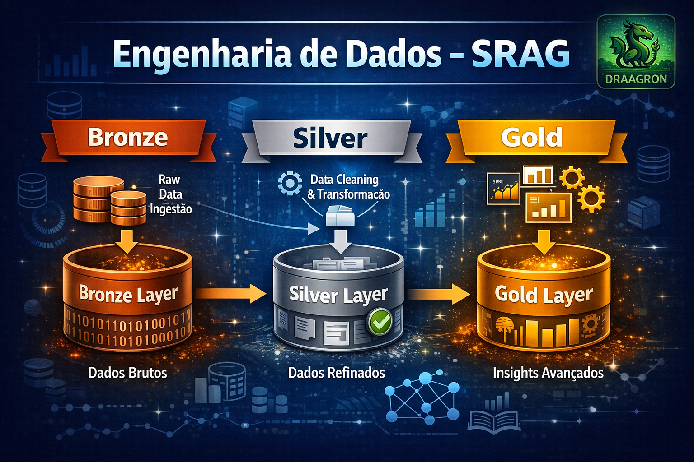
</p>


### Pipeline Medallion · Databricks · Delta Lake · Modelagem Epidemiológica

<br>

[](https://databricks.com)
[](https://spark.apache.org)
[](https://delta.io)
[](https://docs.databricks.com/data-governance/unity-catalog)
[](https://opendatasus.saude.gov.br)

<br>

**Feito por Nicolas de Siqueira França**  
📧 [nicolas.draagron@gmail.com](mailto:nicolas.draagron@gmail.com)

</div>

---

> **Escopo deste README:** camada de **Engenharia de Dados** — Bronze → Quality → EDA → Silver → Gold + RAG.  
> Os detalhes do *Agente* (orquestração, web/news, prompt, tools) ficam em um README separado.

---

## 📋 Sumário

| # | Seção |
|---|-------|
| 1 | [Visão Geral](#1-visão-geral) |
| 2 | [Arquitetura](#2-arquitetura) |
| 3 | [Dataset e Escopo Temporal](#3-dataset-e-escopo-temporal) |
| 4 | [Como Executar](#4-como-executar) |
| 5 | [Bronze](#5-bronze) |
| 6 | [Data Quality](#6-data-quality) |
| 7 | [EDA — Exploração Analítica](#7-eda--exploração-analítica) |
| 8 | [Silver](#8-silver) |
| 9 | [Gold](#9-gold) |
| 10 | [RAG Layer](#10-rag-layer-tabelas-gold-para-indexação) |
| 11 | [Governança e Rastreabilidade](#11-governança-e-rastreabilidade) |
| 12 | [Resultados Consolidados](#12-resultados-consolidados-outputs-reais) |
| 13 | [Figuras e Gráficos](#13-figuras-e-gráficos) |
| 14 | [Limitações e Próximos Passos](#14-limitações-e-próximos-passos) |
| 15 | [Apêndice — Tabelas Produzidas](#15-apêndice--tabelas-produzidas) |

---

## 1. Visão Geral

Este projeto implementa um **pipeline completo** para transformar dados brutos do **SIVEP-Gripe (SRAG)** em uma base:

| Atributo | Descrição |
|---|---|
| 🔬 Epidemiologicamente consistente | Filtros clínico-epidemiológicos, flags e domínios padronizados |
| 🔍 Auditável | `process_id`, `snapshot`, histórico Delta Lake |
| 📦 Versionada | Unity Catalog + Delta time travel |
| 📊 Pronta para consumo analítico | Métricas Gold para BI/relatórios |
| 🤖 Pronta para RAG | Documentos semânticos indexáveis por embeddings/Vector Search |

### 🛠️ Tecnologias

- **Databricks** (Serverless)
- **Apache Spark 4.x**
- **Delta Lake**
- **Unity Catalog** (catálogos / schemas / tabelas)

---

## 2. Arquitetura

### 2.1 Visão Macro — Medallion + Controles

```
Raw CSV (SIVEP-Gripe)
        │
        ▼
  ┌─────────────┐
  │   BRONZE    │  Ingestão estruturada + metadados técnicos
  └──────┬──────┘
         │
         ▼
  ┌─────────────┐
  │   QUALITY   │  Validação formal (score + histórico)
  └──────┬──────┘
         │
         ▼
  ┌─────────────┐
  │     EDA     │  Exploração e verificação de indicadores
  └──────┬──────┘
         │
         ▼
  ┌─────────────┐
  │   SILVER    │  Padronização epidemiológica + filtros + flags
  └──────┬──────┘
         │
         ▼
  ┌─────────────┐
  │    GOLD     │  Métricas analíticas (temporal, geográfica, demográfica)
  └──────┬──────┘
         │
         ▼
  ┌─────────────┐
  │     RAG     │  Documentos semânticos (facts) + dicionário de regras
  └─────────────┘
```

<p align="center">
  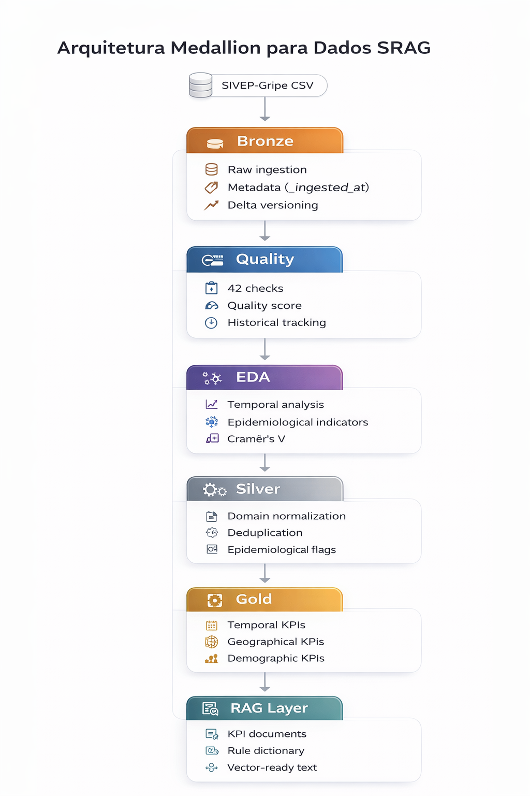
</p>

> Diagrama completo da arquitetura Medallion implementada: cada camada tem responsabilidade única e rastreabilidade garantida por `process_id` e `data_snapshot`. O fluxo é linear e determinístico, permitindo auditoria ponta a ponta.

---

## 3. Dataset e Escopo Temporal

| Atributo | Valor |
|---|---|
| Anos processados (Bronze) | **2023, 2024, 2025** |
| Volume total | **~823 MB** (3 CSVs) |
| Formato final | **Delta Lake** |
| Período observado (Silver) | **2023-01-01 a 2025-12-21** (baseado em `dt_sin_pri`) |

---

## 4. Como Executar

> ⚠️ **Ordem recomendada** de execução dos notebooks no Databricks:

```
1.  01_Bronze_Ingestion_SRAG
2.  02_Data_Quality_Validation
3.  03_eda_srag_exploraty_analysis
4.  01_Silver_SRAG
5.  00_pipeline_gold              ← orquestrador da camada Gold
6.  05_gold_base_conhecimento_rag
```

### 4.1 Convenções de Reprodutibilidade

- Execute preferencialmente via **pipeline/orquestrador** para manter `data_snapshot` e `process_id` consistentes entre notebooks.
- Em execução **standalone**, alguns notebooks podem usar fallback para `current_date()` no campo `data_snapshot`.

---

## 5. Bronze

**Objetivo:** Preservar os dados originais com rastreabilidade total, tolerando variações de schema entre anos.

**Saída:** `dbx_srag_lab.data_original.bronze_srag_raw`

### O que acontece na prática

- Leitura de CSVs (encoding `ISO-8859-1`, separador `;`, schema como string)
- União de anos com tolerância a colunas faltantes
- Injeção de metadados técnicos:

| Campo | Descrição |
|---|---|
| `_ingested_at` | Timestamp da ingestão |
| `_source_file` | Arquivo CSV de origem |
| `_ingestion_run_id` | ID da execução |

- *Dry-run* executado antes da ingestão completa

---

## 6. Data Quality

**Objetivo:** Executar validações formais na Bronze e persistir evidências de qualidade e tendências.

**Saídas:**
- `dbx_srag_lab.data_original.quality_checks`
- `dbx_srag_lab.data_original.quality_summary`

### Checks Executados

| Tipo | Descrição |
|---|---|
| Completude | Detecção de NULLs por campo |
| Domínio | Valores fora do conjunto aceito |
| Formato de datas | Parsing e consistência |
| Unicidade | Verificação de `NU_NOTIFIC` |
| Consistência temporal | Ex.: data sintomas ≤ data internação |

> **Estratégia importante:** alguns checks são **CRITICAL não-bloqueantes** por design — a camada **Silver** corrige/filtra downstream. O objetivo do Quality é **governança + diagnóstico**, não interromper o pipeline a cada ruído comum de notificação.

---

## 7. EDA — Exploração Analítica

**Objetivo:** Explorar o comportamento temporal, geográfico e demográfico e validar (pré-Gold) indicadores epidemiológicos.

**Tabelas geradas:**

| Tabela | Conteúdo |
|---|---|
| `eda_serie_diaria_90d` | Série diária — últimos 90 dias |
| `eda_series_mensal` | Agregação mensal com crescimento |
| `eda_mortalidade_mensal` | Taxa de mortalidade por mês/ano |
| `eda_vacinacao_mensal` | Cobertura vacinal por mês/ano |

---

### 7.1 Comportamento Temporal

> Janela: **2025-01-21 → 2025-12-21** · Média mensal: **26.035 casos** · Maior mês: **2025-05 com 56.456 casos**

#### 📊 Série Diária — Últimos 90 Dias

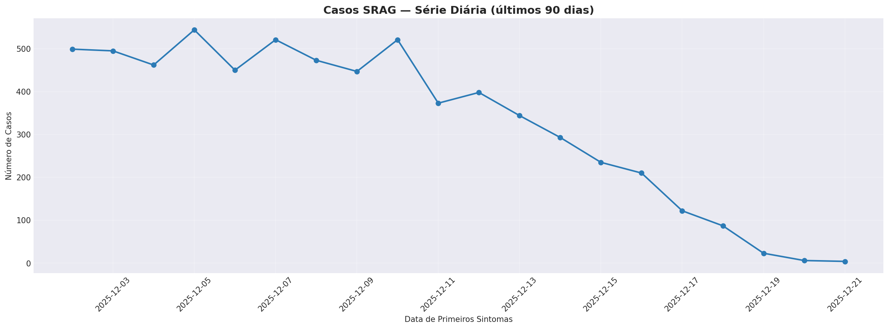

> Visualiza a distribuição diária de casos por data de primeiros sintomas na janela recente de 90 dias. Permite identificar picos pontuais e avaliar a tendência de curto prazo do pipeline de monitoramento.

#### 📊 Casos por Mês — Últimos 12 Meses

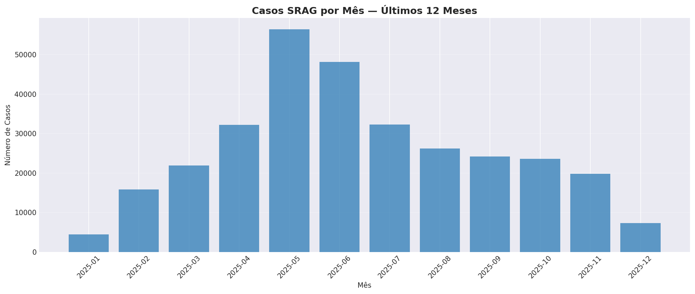

> Série mensal com crescimento relativo mês a mês. Crescimento médio de **+23,93%/mês**, com alta máxima de **+258,62%** e queda máxima de **-63,25%** — evidenciando forte sazonalidade operacional.

#### 📊 Sazonalidade por Semana Epidemiológica

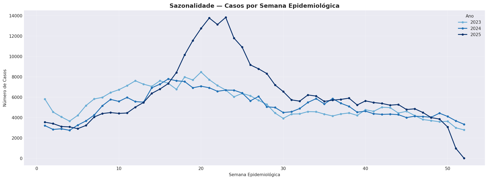

> Sobreposição histórica de 2023–2025 por semana epidemiológica. Semanas de pico consistentes: **SE21 · SE20 · SE23 · SE22 · SE19** — padrão sazonal de inverno reproduzível entre os anos analisados.

---

### 7.2 Indicadores Clínicos

#### 📊 Mortalidade SRAG — 2023 a 2025

| Ano | Óbitos | Total com desfecho | Taxa |
|---|---|---|---|
| 2023 | 24.944 | 251.095 | **9,93%** |
| 2024 | 20.728 | 240.436 | **8,62%** |
| 2025 | 21.010 | 279.664 | **7,51%** |
| **Total** | **66.682** | **771.195** | **8,65%** |

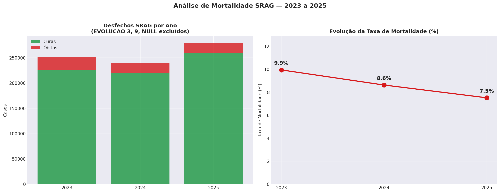

> Barras de desfechos por ano (cura vs óbito, códigos 3 e 9/null excluídos) acompanhadas da linha de evolução da taxa. A queda de **9,93% → 7,51%** entre 2023 e 2025 é o principal indicador de tendência epidemiológica do projeto.

#### 📊 Ocupação UTI — 2023 a 2025

| Ano | UTI | Total internados | Taxa UTI |
|---|---|---|---|
| 2023 | 74.114 | 241.883 | **30,64%** |
| 2024 | 74.071 | 236.510 | **31,32%** |
| 2025 | 83.501 | 286.485 | **29,15%** |
| **Total** | **231.686** | **764.878** | **30,29%** |

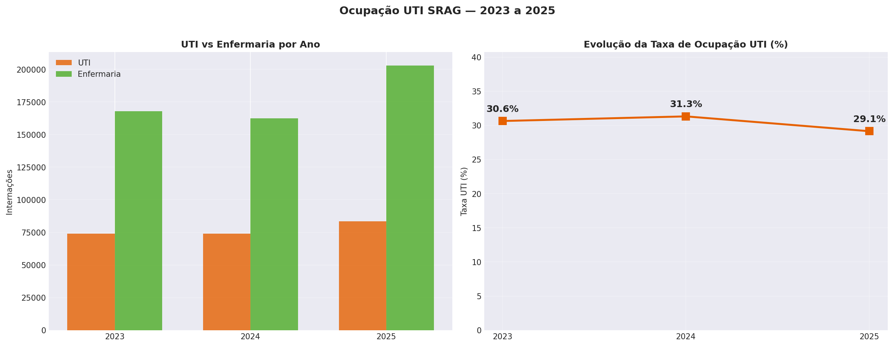

> Indicador hospital-based: calculado sobre internados com `HOSPITAL=1` e `UTI IN (1,2)`. O gráfico combina barras agrupadas (UTI vs Enfermaria) com linha de evolução da taxa — evidenciando estabilidade da ocupação em torno de **30%** nos três anos.

---

### 7.3 Vacinação

#### 📊 Cobertura Vacinal — 2023 a 2025

| Ano | Vacinados | Base válida | Taxa |
|---|---|---|---|
| 2023 | 18.767 | 79.840 | **23,51%** |
| 2024 | 40.208 | 176.470 | **22,78%** |
| 2025 | 85.110 | 295.311 | **28,82%** |
| **Total** | **144.085** | **551.621** | **26,12%** |

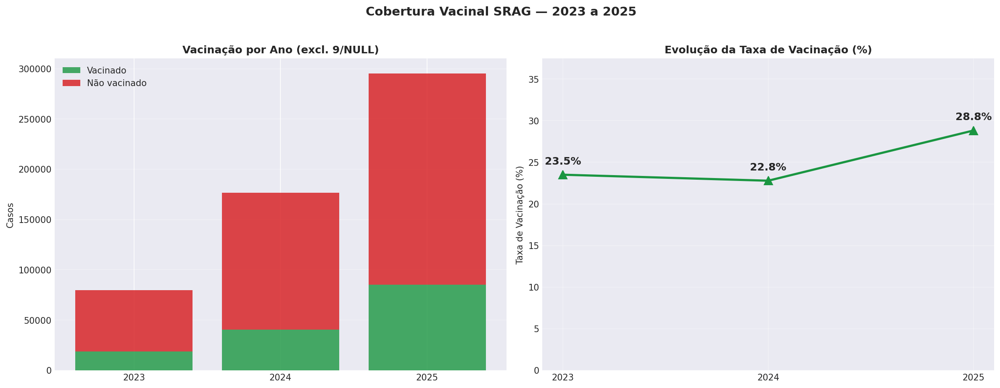

> Denominador: registros com `VACINA IN (1,2)` — códigos 9 e NULL excluídos. A elevação para **28,82%** em 2025 sinaliza aumento de cobertura, com `VACINA_COV` tratada separadamente na Silver e Gold.

---

### 7.4 Associações Clínicas

#### 📊 Cramér's V — Associações Categóricas

| Par de variáveis | Cramér's V | Força |
|---|---|---|
| `DISPNEIA` ↔ `SATURACAO` | **0,334** | 🟡 Moderada |
| `FEBRE` ↔ `TOSSE` | **0,218** | 🟡 Moderada |
| `UTI` ↔ `EVOLUCAO` | **0,218** | 🟡 Moderada |

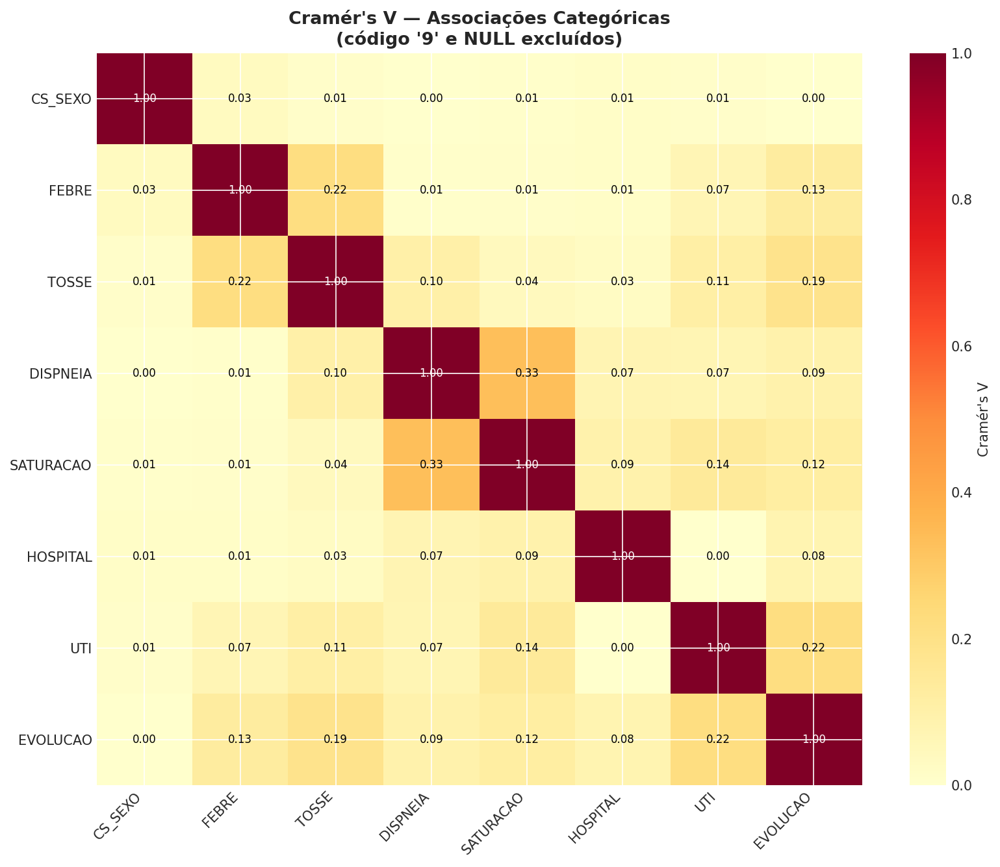

> Análise de associação entre variáveis clínicas categóricas (códigos 9 e NULL excluídos). A relação moderada entre `UTI` e `EVOLUCAO` (0,218) embasa diretamente a construção das flags epidemiológicas `is_uti_valido` e `is_obito_srag` na camada Silver.

---

## 8. Silver

**Objetivo:** Padronizar domínios, corrigir problemas conhecidos, aplicar filtros clínico-epidemiológicos e produzir a base confiável para métricas.

**Saída:** `dbx_srag_lab.silver.silver_srag_clean`

### 8.1 Transformações Essenciais

| Etapa | Descrição |
|---|---|
| Parsing de datas | Conversão segura, tratamento de formatos inválidos |
| Normalização de domínios | Geração dos campos `_clean` |
| Deduplicação | Determinística por `NU_NOTIFIC` |
| F1 | Campos obrigatórios presentes |
| F2 | Consistência temporal |
| F3 | Idade válida (0–120 anos) |
| F4 | Deduplicação final |

Essa estrutura garante que a Silver não apenas limpe dados, mas formalize regras epidemiológicas explícitas, criando uma base determinística e auditável para geração das métricas Gold.

<p align="center">
  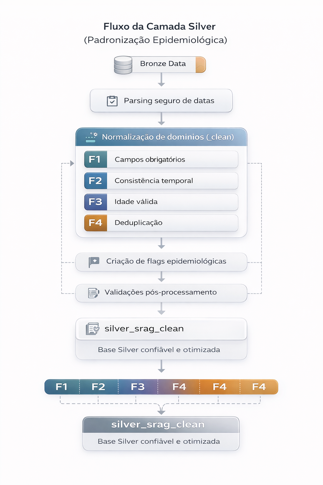
</p>

> Fluxo completo da transformação Silver: desde o parsing seguro de datas e normalização de domínios (`_clean`), passando pelos filtros F1–F4, até a geração das flags epidemiológicas e otimização física com particionamento e Z-Order.

---

### 8.2 Campos `_clean` (exemplos)

| Campo | Regra |
|---|---|
| `evolucao_clean` | Mantém `1/2`, demais → NULL |
| `vacina_clean` | Mantém `1/2`, demais → NULL |
| `vacina_cov_clean` | Mantém `1/2`, demais → NULL |
| `hospital_clean` | Normalização de domínio |
| `uti_clean` | Normalização de domínio |
| `cs_sexo_clean` | Normalização de domínio |
| `classi_fin_clean` | Normalização de domínio |

### 8.3 Flags Epidemiológicas

```
is_obito_srag       is_cura
is_internado        is_uti_valido
is_vacinado         is_vacinado_covid
is_covid            is_influenza         is_outro_virus
```

### 8.4 Otimização Física

| Configuração | Valor |
|---|---|
| Partições | `ano` + `mes` |
| Z-Order | `dt_sin_pri`, `sg_uf` |
| Pós-escrita | `OPTIMIZE` + `ANALYZE` |

A partir dessa base padronizada e validada, a camada Gold consolida indicadores oficiais, agregando dados sob regras epidemiológicas consistentes.

---

## 9. Gold

**Objetivo:** Gerar métricas analíticas oficiais, prontas para consumo em BI/relatórios, consistentes com as regras epidemiológicas definidas.

### Tabelas Produzidas

**⏱️ Temporais**

| Tabela | Descrição |
|---|---|
| `gold_metricas_temporais` | KPIs dos últimos 12 meses |
| `gold_metricas_historicas` | Histórico mensal completo |
| `gold_serie_diaria_30d` | Série diária — últimos 30 dias |

**🗺️ Geográficas**

| Tabela | Descrição |
|---|---|
| `gold_metricas_geograficas` | Ranking por UF, municípios, percentuais |

**👥 Demográficas**

| Tabela | Descrição |
|---|---|
| `gold_metricas_demograficas` | Faixa etária × sexo, taxas |

> As etapas analíticas do pipeline Gold podem ser executadas em **paralelo**.

<p align="center">
  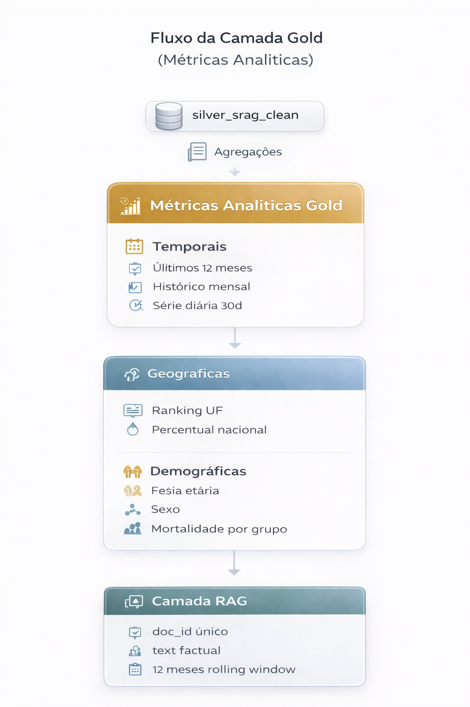
</p>

> Diagrama do fluxo Gold: a Silver alimenta três eixos analíticos em paralelo (temporal, geográfico e demográfico), cujos resultados convergem para as tabelas RAG de fatos e dicionário de regras, prontas para indexação semântica.

---

## 10. RAG Layer (Tabelas Gold para Indexação)

**Objetivo:** Criar duas tabelas Gold para consumo por embeddings / Vector Search e recuperação contextual.

| Tabela | Descrição |
|---|---|
| `gold_rag_kpi_fatos` | Documentos semânticos com KPIs agregados + campo `text` factual em linguagem natural |
| `gold_rag_dicionario_regras` | Dicionário de regras epidemiológicas e técnicas (com impacto e justificativa) |

### Garantias

- ✅ `doc_id` sem duplicatas
- ✅ Campo `text` não vazio
- ✅ Janela mensal/UF limitada aos **últimos 12 meses** (relevância operacional)

---

## 11. Governança e Rastreabilidade

O pipeline foi desenhado para ser **totalmente auditável**:

| Mecanismo | Descrição |
|---|---|
| `process_id` | Identificador único por execução |
| `data_snapshot` | Timestamp de snapshot (via pipeline) |
| Delta History | Histórico de versões em todas as tabelas |
| Logs de execução | Contagens, períodos e validações pós-escrita |
| `quality_summary` | Tendência histórica do score de qualidade |

---

## 12. Resultados Consolidados (Outputs Reais)

### 12.1 Bronze — Ingestão

| Métrica | Valor |
|---|---|
| Total de registros | **870.914** |
| Colunas | **198** |
| Anos cobertos | **2023 – 2025** |
| Dry-run | ✅ OK para os 3 arquivos |

---

### 12.2 Data Quality

| Métrica | Valor |
|---|---|
| Total de checks | **42** |
| Quality Score | **0.7143** ⚠️ WARN |
| Principal ausência | `VACINA` (~24%), `SATURACAO` (~15%), `DT_EVOLUCA` (~14%) |

---

### 12.3 EDA — Insights de Alto Valor

| Indicador | Valor |
|---|---|
| Mortalidade SRAG (estrita) | **8,65%** |
| Taxa UTI (hospital-based) | **30,29%** |
| Cobertura vacinal geral | **26,12%** |
| Concentração Top 5 UFs | **66%** do total nacional |
| Sazonalidade | Pico médio entre **SE19 – SE23** |

---

### 12.4 Silver — Base Confiável

| Etapa | Registros |
|---|---|
| Bronze (entrada) | 870.914 |
| Silver (saída) | **863.092** |
| Exclusão total | **0,90%** |
| F2 — temporal | 7.798 removidos |
| F4 — deduplicação | 20 removidos |
| Unicidade `NU_NOTIFIC` | ✅ |

**Indicadores recalculados por ano:**

| Indicador | 2023 | 2024 | 2025 |
|---|---|---|---|
| Mortalidade (estrita) | 9,83% | 8,53% | 7,43% |
| UTI (hospital-based) | 27,65% | 28,71% | 26,76% |
| Vacinação | 23,54% | 22,96% | 28,77% |

---

### 12.5 Gold — Métricas

| Métrica | Valor |
|---|---|
| Execução | ✅ Pipeline OK com paralelização |
| Tempo total | **136,5s** |
| Temporais — exemplo maio/2025 | 56.033 casos |
| Temporais — exemplo dez/2025 | 7.193 casos |
| Geográficas | 27 UFs — SP ~25,8% do total nacional |
| Demográficas | Alerta: lactentes (TP_IDADE=1/2) e massa em "Desconhecido" → melhoria futura |

---

### 12.6 RAG Tables

| Tabela | Documentos |
|---|---|
| `gold_rag_kpi_fatos` | **339 documentos** |
| &nbsp;&nbsp;↳ `kpi_mensal_uf` | 324 |
| &nbsp;&nbsp;↳ `kpi_mensal_brasil` | 12 |
| &nbsp;&nbsp;↳ `kpi_anual` | 3 |
| `gold_rag_dicionario_regras` | **8 regras** |
| Integridade | ✅ `doc_id` único + `text` não vazio |

---

## 13. Figuras e Gráficos

### 13.1 Diagramas Arquiteturais

| Arquivo | Posição no README | Descrição |
|---|---|---|
| `images/01_arquitetura_medallion.png` | Seção 2 — Arquitetura | Fluxo completo Bronze → RAG |
| `images/02_fluxo_silver.png` | Seção 8 — Silver | Parsing → filtros F1–F4 → flags → otimização |
| `images/03_fluxo_gold.png` | Seção 9 — Gold | Temporais / geográficas / demográficas → RAG |

### 13.2 Gráficos do EDA

| Arquivo | Descrição |
|---|---|
| `images/graficos/eda_01_serie_diaria_90d.png` | Série diária — últimos 90 dias |
| `images/graficos/eda_02_casos_mensal_12m.png` | Casos por mês — últimos 12 meses |
| `images/graficos/eda_04_sazonalidade_semana.png` | Sazonalidade por semana epidemiológica |
| `images/graficos/eda_10_desfechos_e_mortalidade.png` | Desfechos SRAG + evolução da mortalidade |
| `images/graficos/eda_11_uti_internacao.png` | UTI vs enfermaria + evolução da taxa UTI |
| `images/graficos/eda_12_vacinacao.png` | Vacinação + evolução da taxa de vacinação |
| `images/graficos/eda_15_cramers_v.png` | Associações categóricas (Cramér's V) |

### 13.3 Gráficos Complementares (gerados, não exibidos inline)

| Arquivo | Descrição |
|---|---|
| `images/graficos/eda_03_crescimento_mensal_12m.png` | Taxa de crescimento mensal (%) |
| `images/graficos/eda_05_casos_por_ano.png` | Casos por ano |
| `images/graficos/eda_06_top_ufs.png` | Top 15 UFs |
| `images/graficos/eda_07_distribuicao_sexo.png` | Distribuição por sexo |
| `images/graficos/eda_08_faixa_etaria.png` | Distribuição por faixa etária |
| `images/graficos/eda_09_classificacao_etiologica.png` | Classificação etiológica por ano |
| `images/graficos/eda_13_distribuicao_etaria_ano.png` | Distribuição etária por ano (%) |
| `images/graficos/eda_14_sazonalidade_historica.png` | Sazonalidade histórica — sobreposição e heatmap |
| `images/graficos/eda_15_mortalidade_faixa_etaria.png` | Taxa de mortalidade por faixa etária e ano |
| `images/graficos/eda_16_desfechos_total.png` | Desfechos SRAG — total |
| `images/graficos/eda_17_uti_vs_enfermaria.png` | UTI vs enfermaria (visão geral) |
| `images/graficos/eda_18_status_vacinacao.png` | Status de vacinação (VACINA) |
| `images/graficos/eda_20_missingness.png` | Ausência por campo (NULL/vazio) |
| `images/graficos/eda_21_code9.png` | Incidência de código 9 por campo |

---

## 14. Limitações e Próximos Passos

### ⚠️ Limitações Conhecidas

| Limitação | Detalhe |
|---|---|
| Pipeline não incremental | Overwrite — adequado para certificação/PoC; evoluir para MERGE em produção |
| Idade pediátrica | `TP_IDADE=1/2` (dias/meses) ainda não convertida → massa em "Desconhecido" |
| RAG mensal | Limitado a 12 meses por decisão de relevância operacional |

### 🚀 Próximos Passos

- [ ] Criar `idade_dias_equiv` na Silver para `TP_IDADE=1/2`
- [ ] Evoluir ingestão e Silver para processamento incremental (MERGE por ANO/MÊS)
- [ ] Adicionar testes automatizados (expectations) e monitoramento de drift/quality_score
- [ ] (Opcional) Materializar dicionário de campos no data catalog

---

## 15. Apêndice — Tabelas Produzidas

| Camada | Tabela | Descrição |
|---|---|---|
| 🥉 Bronze | `data_original.bronze_srag_raw` | Ingestão bruta + metadados |
| ✅ Quality | `data_original.quality_checks` | Checks detalhados por execução |
| ✅ Quality | `data_original.quality_summary` | Score e resumo por execução |
| 🔍 EDA | `data_original.eda_serie_diaria_90d` | Série diária 90d |
| 🔍 EDA | `data_original.eda_series_mensal` | Série mensal |
| 🔍 EDA | `data_original.eda_mortalidade_mensal` | Mortalidade mensal |
| 🔍 EDA | `data_original.eda_vacinacao_mensal` | Vacinação mensal |
| 🥈 Silver | `silver.silver_srag_clean` | Base limpa, deduplicada, com flags |
| 🥇 Gold | `gold_metricas_temporais` | KPIs temporais (12m) |
| 🥇 Gold | `gold_metricas_historicas` | Histórico mensal |
| 🥇 Gold | `gold_serie_diaria_30d` | Série diária 30d |
| 🥇 Gold | `gold_metricas_geograficas` | KPIs por UF |
| 🥇 Gold | `gold_metricas_demograficas` | KPIs demográficos |
| 🤖 RAG | `gold_rag_kpi_fatos` | Documentos semânticos com campo `text` |
| 🤖 RAG | `gold_rag_dicionario_regras` | Regras formais para recuperação |

---

<p align="center">
  
</p>
